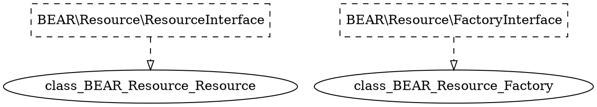

# Ray.Di Complete Manual

This comprehensive manual contains all Ray.Di documentation in a single page for easy reference, printing, or offline viewing.

---

# Installation

The recommended way to install Ray.Di is through [Composer](https://github.com/composer/composer).

```bash
composer require ray/di ^2.0
```

The GitHub repository is at [ray-di/Ray.Di](https://github.com/ray-di/Ray.Di)

## Testing Ray.Di

Here's how to install Ray.Di from source and run the unit tests and demos.

```bash
git clone https://github.com/ray-di/Ray.Di.git
cd Ray.Di
./vendor/bin/phpunit
php demo-php8/run.php
```


---

# Motivation

Wiring everything together is a tedious part of application development. There
are several approaches to connect data, service, and presentation classes to one
another. To contrast these approaches, we'll write the billing code for a pizza
ordering website:

```php
interface BillingServiceInterface
{
    /**
    * Attempts to charge the order to the credit card. Both successful and
    * failed transactions will be recorded.
    *
    * @return Receipt a receipt of the transaction. If the charge was successful,
    *      the receipt will be successful. Otherwise, the receipt will contain a
    *      decline note describing why the charge failed.
    */
    public function chargeOrder(PizzaOrder order, CreditCard creditCard): Receipt;
}
```

Along with the implementation, we'll write unit tests for our code. In the tests
we need a `FakeCreditCardProcessor` to avoid charging a real credit card!

## Direct constructor calls

Here's what the code looks like when we just `new` up the credit card processor
and transaction logger:

```php
class RealBillingService implements BillingServiceInterface
{
    public function chargeOrder(PizzaOrder $order, CreditCard $creditCard): Receipt
    {
        $processor = new PaypalCreditCardProcessor();
        $transactionLog = new DatabaseTransactionLog();

        try {
            $result = $processor->charge($creditCard, $order->getAmount());
            $transactionLog->logChargeResult($result);

            return $result->wasSuccessful()
                ? Receipt::forSuccessfulCharge($order->getAmount())
                : Receipt::forDeclinedCharge($result->getDeclineMessage());
        } catch (UnreachableException $e) {
            $transactionLog->logConnectException($e);

            return Receipt::forSystemFailure($e->getMessage());
        }
    }
}
```

This code poses problems for modularity and testability. The direct,
compile-time dependency on the real credit card processor means that testing the
code will charge a credit card! It's also awkward to test what happens when the
charge is declined or when the service is unavailable.

## Factories

A factory class decouples the client and implementing class. A simple factory
uses static methods to get and set mock implementations for interfaces. A
factory is implemented with some boilerplate code:

```php
class CreditCardProcessorFactory
{
    private static CreditCardProcessor $instance;
    
    public static setInstance(CreditCardProcessor $processor): void 
    {
        self::$instance = $processor;
    }
    
    public static function getInstance(): CreditCardProcessor
    {
        if (self::$instance == null) {
            return new SquareCreditCardProcessor();
        }
        
        return self::$instance;
    }
}
```

In our client code, we just replace the `new` calls with factory lookups:

```php
class RealBillingService implements BillingServiceInterface
{
    public function chargeOrder(PizzaOrder $order, CreditCard $creditCard): Receipt
    {
        $processor = CreditCardProcessorFactory::getInstance();
        $transactionLog = TransactionLogFactory::getInstance();
        
        try {
            $result = $processor->charge($creditCard, $order->getAmount());
            $transactionLog->logChargeResult($result);
            
            return $result->wasSuccessful()
                ? Receipt::forSuccessfulCharge($order->getAmount())
                : Receipt::forDeclinedCharge($result->getDeclineMessage());
        } catch (UnreachableException $e) {
            $transactionLog->logConnectException($e);
            return Receipt::forSystemFailure($e->getMessage());
        }
    }
}
```

The factory makes it possible to write a proper unit test:

```php
class RealBillingServiceTest extends TestCase 
{
    private PizzaOrder $order;
    private CreditCard $creditCard;
    private InMemoryTransactionLog $transactionLog;
    private FakeCreditCardProcessor $processor;
    
    public function setUp(): void
    {
        $this->order = new PizzaOrder(100);
        $this->creditCard = new CreditCard('1234', 11, 2010);
        $this->processor = new FakeCreditCardProcessor();
        TransactionLogFactory::setInstance($transactionLog);
        CreditCardProcessorFactory::setInstance($this->processor);
    }
    
    public function tearDown(): void
    {
        TransactionLogFactory::setInstance(null);
        CreditCardProcessorFactory::setInstance(null);
    }
    
    public function testSuccessfulCharge()
    {
        $billingService = new RealBillingService();
        $receipt = $billingService->chargeOrder($this->order, $this->creditCard);

        $this->assertTrue($receipt->hasSuccessfulCharge());
        $this->assertEquals(100, $receipt->getAmountOfCharge());
        $this->assertEquals($creditCard, $processor->getCardOfOnlyCharge());
        $this->assertEquals(100, $processor->getAmountOfOnlyCharge());
        $this->assertTrue($this->transactionLog->wasSuccessLogged());
    }
}
```

This code is clumsy. A global variable holds the mock implementation, so we need
to be careful about setting it up and tearing it down. Should the `tearDown`
fail, the global variable continues to point at our test instance. This could
cause problems for other tests. It also prevents us from running multiple tests
in parallel.

But the biggest problem is that the dependencies are *hidden in the code*. If we
add a dependency on a `CreditCardFraudTracker`, we have to re-run the tests to
find out which ones will break. Should we forget to initialize a factory for a
production service, we don't find out until a charge is attempted. As the
application grows, babysitting factories becomes a growing drain on
productivity.

Quality problems will be caught by QA or acceptance tests. That may be
sufficient, but we can certainly do better.

## Dependency Injection

Like the factory, dependency injection is just a design pattern. The core
principle is to *separate behaviour from dependency resolution*. In our example,
the `RealBillingService` is not responsible for looking up the `TransactionLog`
and `CreditCardProcessor`. Instead, they're passed in as constructor parameters:

```php
class RealBillingService implements BillingServiceInterface
{
    public function __construct(
        private readonly CreditCardProcessor $processor,
        private readonly TransactionLog $transactionLog
    ) {}
    
    public chargeOrder(PizzaOrder $order, CreditCard $creditCard): Receipt
    {
        try {
            $result = $this->processor->charge($creditCard, $order->getAmount());
            $this->transactionLog->logChargeResult(result);
        
            return $result->wasSuccessful()
                ? Receipt::forSuccessfulCharge($order->getAmount())
                : Receipt::forDeclinedCharge($result->getDeclineMessage());
        } catch (UnreachableException $e) {
            $this->transactionLog->logConnectException($e);

            return Receipt::forSystemFailure($e->getMessage());
        }
    }
}
```

We don't need any factories, and we can simplify the testcase by removing the
`setUp` and `tearDown` boilerplate:

```php
class RealBillingServiceTest extends TestCase
{
    private PizzaOrder $order;
    private CreditCard $creditCard;
    private InMemoryTransactionLog $transactionLog;
    private FakeCreditCardProcessor $processor;

    public function setUp(): void
    {
        $this->order = new PizzaOrder(100);
        $this->creditCard = new CreditCard("1234", 11, 2010);
        $this->transactionLog = new InMemoryTransactionLog();
        $this->processor = new FakeCreditCardProcessor();      
    }
    
    public function testSuccessfulCharge()
    {
        $billingService= new RealBillingService($this->processor, $this->transactionLog);
        $receipt = $billingService->chargeOrder($this->order, $this->creditCard);
        
        $this->assertTrue($receipt->hasSuccessfulCharge());
        $this->assertSame(100, $receipt->getAmountOfCharge());
        $this->assertSame($this->creditCard, $this->processor->getCardOfOnlyCharge());
        $this->assertSame(100, $this->processor->getAmountOfOnlyCharge());
        $this->assertTrue($this->transactionLog->wasSuccessLogged());
    }
}
```

Now, whenever we add or remove dependencies, the compiler will remind us what
tests need to be fixed. The dependency is *exposed in the API signature*.

Unfortunately, now the clients of `BillingService` need to lookup its
dependencies. We can fix some of these by applying the pattern again! Classes
that depend on it can accept a `BillingService` in their constructor. For
top-level classes, it's useful to have a framework. Otherwise you'll need to
construct dependencies recursively when you need to use a service:

```php
<?php
$processor = new PaypalCreditCardProcessor();
$transactionLog = new DatabaseTransactionLog();
$billingService = new RealBillingService($processor, $transactionLog);
// ...
```

## Dependency Injection with Ray.Di

The dependency injection pattern leads to code that's modular and testable, and
Ray.Di makes it easy to write. To use Ray.Di in our billing example, we first need
to tell it how to map our interfaces to their implementations. This
configuration is done in a Ray.Di module, which is any PHP class that implements
the `Module` interface:

```php
class BillingModule extends AbstractModule
{
    protected function configure(): void
    {
        $this->bind(TransactionLog::class)->to(DatabaseTransactionLog::class);
        $this->bind(CreditCardProcessor::class)->to(PaypalCreditCardProcessor::class);
        $this->bind(BillingServiceInterface::class)->to(RealBillingService::class);
    }
}
```

Ray.Di will inspect the  constructor, and lookup values for each parameter.

```php
class RealBillingService implements BillingServiceInterface
{
    public function __construct(
        private readonly CreditCardProcessor $processor,
        private readonly TransactionLog $transactionLog
    ) {}

    public function chargeOrder(PizzaOrder $order, CreditCard $creditCard): Receipt
    {
        try {
          $result = $this->processor->charge($creditCard, $order->getAmount());
          $this->transactionLog->logChargeResult($result);
        
          return $result->wasSuccessful()
              ? Receipt::forSuccessfulCharge($order->getAmount())
              : Receipt::forDeclinedCharge($result->getDeclineMessage());
         } catch (UnreachableException $e) {
            $this->transactionLog->logConnectException($e);

            return Receipt::forSystemFailure($e->getMessage());
        }
    }
}
```

Finally, we can put it all together. The `Injector` can be used to get an
instance of any of the bound classes.

```php
<?php
$injector = new Injector(new BillingModule());
$billingService = $injector->getInstance(BillingServiceInterface::class);
//...

```

[Getting started](getting_started.html) explains how this all works.


---

# GettingStarted

_How to start doing dependency injection with Ray.Di._

## Getting Started

Ray.Di is a framework that makes it easier for your application to use the dependency injection (DI) pattern. This getting started guide will walk you through a simple example of how you can use Ray.Di to incorporate dependency injection into your application.

### What is dependency injection?

[Dependency injection](https://en.wikipedia.org/wiki/Dependency_injection) is a design pattern wherein classes declare their dependencies as arguments instead
of creating those dependencies directly. For example, a client that wishes to call a service should not have to know how to construct the service, rather, some external code is responsible for providing the service to the client.

Here's a simple example of code that *does not* use dependency injection:

```php
class Foo
{
    private Database $database;  // We need a Database to do some work
    
    public function __construct()
    {
        // Ugh. How could I test this? What if I ever want to use a different
        // database in another application?
        $this->database = new Database('/path/to/my/data');
    }
}
```

The `Foo` class above creates a fixed `Database` object directly. This prevents this class from being used with other `Database` objects and does not allow the real database to be swapped out for a testing database in tests. Instead of writing untestable or inflexible code, you can use dependency injection pattern
to address all these issues.

Here's the same example, this time using dependency injection:

```php
class Foo {
    private Database $database;  // We need a Database to do some work
    
    public function __construct(Database $database)
    {
        // The database comes from somewhere else. Where? That's not my job, that's
        // the job of whoever constructs me: they can choose which database to use.
        $this->database = $database;
    }
}
```

The `Foo` class above can be used with any `Database` objects since `Foo` has no knowledge of how the `Database` is created. For example, you can create a test version of `Database` implementation that uses an in-memory database in tests to make the test hermetic and fast.

The [Motivation](Motivation.md) page explains why applications should use the dependency injection pattern in more detail.

## Core Ray.Di concepts

### constructor

PHP class constructors can be called by Ray.Di through a process called [constructor injection](Injections.md#constructor-injection), during which the constructors' arguments will be created and provided by Ray.Di. (Unlike Guice, Ray.Di does not require the "Inject" annotation in its constructor.)

Here is an example of a class that uses constructor injection:

```php
class Greeter
{
    // Greeter declares that it needs a string message and an integer
    // representing the number of time the message to be printed.
    public function __construct(
        #[Message] readonly string $message,
        #[Count] readonly int $count
    ) {}

    public function sayHello(): void
    {
        for ($i=0; $i < $this->count; $i++) {
            echo $message;
        }
    }
}
```

In the example above, the `Greeter` class has a constructor that is called whenapplication asks Ray.Di to create an instance of `Greeter`. Ray.Di will create the two arguments required, then invoke the constructor. The `Greeter` class's constructor arguments are its dependencies and applications use `Module` to tell Ray.Di how to satisfy those dependencies.

### Ray.Di modules

Applications contain objects that declare dependencies on other objects, and those dependencies form graphs. For example, the above `Greeter` class has two dependencies (declared in its constructor):

*   A `string` value for the message to be printed
*   An `int` value for the number of times to print the message

Ray.Di modules allow applications to specify how to satisfy those dependencies. For example, the following `DemoModule` configures all the necessary dependencies for `Greeter` class:

```php
class CountProvider implements ProviderInterface
{
    public function get(): int
    {
        return 3;
    }
}

class MessageProvider implements ProviderInterface
{
    public function get(): string
    {
        return 'hello world';
    }
}

/**
 * Ray.Di module that provides bindings for message and count used in
 * {@link Greeter}.
 */
class DemoModule extends AbstractModule
{
    protected function configure(): void
    {
        $this->bind()->annotatedWith(Count::class)->toProvider(CountProvider::class);
        $this->bind()->annotatedWith(Message::class)->toProvider(MessageProvider::class);
    }
}
```

In a real application, the dependency graph for objects will be much more complicated and Ray.Di makes creating complex object easy by creating all the [transitive dependencies](https://en.wikipedia.org/wiki/Transitive_dependency) automatically.

### Ray.Di injectors

To bootstrap your application, you'll need to create a Ray.Di `Injector` withone or more modules in it. For example, a web server script might that looks like this:

```php
final class MyWebServer {
    public function __construct(
        private readonly RequestLoggingInterface $requestLogging,
        private readonly RequestHandlerInterface $requestHandler,
        private readonly AuthenticationInterface $authentication,
        private readonly Database $database
    ) {}

    public function start(): void
    {
        //　...
    }
    
    public function __invoke(): void
    {
        // Creates an injector that has all the necessary dependencies needed to
        // build a functional server.
        $injector = new Injector(class extends AbstractModule {
            protected function configure(): void
            {
                // Install the modules that provide the necessary dependencies.
                $this->install(new RequestLoggingModule());
                $this->install(new RequestHandlerModule());
                $this->install(new AuthenticationModule());
                $this->install(new DatabaseModule());
            }
        };
    
        // Bootstrap the application by creating an instance of the server then
        // start the server to handle incoming requests.
        $injector->getInstance(MyWebServer::class)->start();
    }
}

(new MyWebServer)();
```

The injector internally holds the dependency graphs described in your application. When you request an instance of a given type, the injector figures out what objects to construct, resolves their dependencies, and wires everything together. To specify how dependencies are resolved, configure your injector with
[bindings](Bindings).

[`Injector`]: https://github.com/ray-di/Ray.Di/blob/2.x/src/di/InjectorInterface.php

## A simple Ray.Di application

The following is a simple Ray.Di application with all the necessary pieces put
together:

```php
<?php
require __DIR__ . '/vendor/autoload.php';

use Ray\Di\AbstractModule;
use Ray\Di\Di\Qualifier;
use Ray\Di\Injector;

#[Attribute, Qualifier]
class Message
{
}

#[Attribute, Qualifier]
class Count
{
}

class CountProvider implements ProviderInterface
{
    public function get(): int
    {
        return 3;
    }
}

class MessageProvider implements ProviderInterface
{
    public function get(): string
    {
        return 'hello world';
    }
}

class DemoModule extends AbstractModule
{
    protected function configure()
    {
        $this->bind()->annotatedWith(Count::class)->toProvider(CountProvider::class);
        $this->bind()->annotatedWith(Message::class)->toProvider(MessageProvider::class);
    }
}

class Greeter
{
    public function __construct(
        #[Message] private string $message,
        #[Count] private int $count
    ) {}

    public function sayHello(): void
    {
        for ($i = 0; $i < $this->count ; $i++) {
            echo $this->message . PHP_EOL;
        }
    }
}

/*
 * Injector's constructor takes one or more modules.
 * Most applications will call this method exactly once in bootstrap.
 */
$injector = new Injector([new DemoModule]);

/*
 * Now that we've got the injector, we can build objects.
 */
$greeter = $injector->getInstance(Greeter::class);

// Prints "hello world" 3 times to the console.
$greeter->sayHello();
```

The [greeter](https://github.com/ray-di/greeter/blob/master/greeter.php) application constructed a small dependency graph using Ray.Di
that is capable of building instances of `Greeter` class. Large applications
usually have many `Module`s that can build complex objects.

## What's next?

Read more on how to conceptualize Ray.Di with a simple [mental model](mental_model.html).


---

# Ray.Di Mental Model

_Learn about `Key`, `Provider` and how Ray.Di is just a map_

When you are reading about "Dependency Injection", you often see many buzzwords ("Inversion of
control", "Hollywood principle") that make it sound confusing. But
underneath the jargon of dependency injection, the concepts aren't very
complicated. In fact, you might have written something very similar already!
This page walks through a simplified model of Ray.Di implementation, which
should make it easier to think about how it works.


## Ray.Di is a map

Fundamentally, Ray.Di helps you create and retrieve objects for your application
to use. These objects that your application needs are called **dependencies**.

You can think of Ray.Di as being a map[^Ray.Di-map]. Your application code
declares the dependencies it needs, and Ray.Di fetches them for you from its map.
Each entry in the "Ray.Di map" has two parts:

*   **Ray.Di key**: a key in the map which is used to fetch a particular value
    from the map.
*   **Provider**: a value in the map which is used to create objects for your
    application.

Ray.Di keys and Providers are explained below.

[^Ray.Di-map]: The actual implementation of Ray.Di is far more complicated, but a
map is a reasonable approximation for how Ray.Di behaves.

### Ray.Di keys

Ray.Di uses `Key` to identify a dependency that can be resolved using the
"Ray.Di map".

The `Greeter` class used in the [Getting Started](GettingStarted.md) declares two
dependencies in its constructor and those dependencies are represented as `Key`
in Ray.Di:

*   `#[Message] string` --> `$map[$messageKey]`
*   `#[Count] int` --> `$map[$countKey]`

The simplest form of a `Key` represents a type in php:

```php
// Identifies a dependency that is an instance of string.
/** @var string $databaseKey */
$databaseKey = $map[$key];
```

However, applications often have dependencies that are of the same type:

```php
class Message
{
    public function __construct(
    	  public readonly string $text
    ){}
}

class MultilingualGreeter
{
    public function __construct(
      private readonly Message $englishGreeting,
      private readonly Message $spanishGreeting
    ) {}
}
```

Ray.Di uses [binding attributes](BindingAttributes.md) to distinguish dependencies
that are of the same type, that is to make the type more specific:

```php
class MultilingualGreeter
{
    public function __construct(
      #[English] private readonly Message $englishGreeting,
      #[Spanish] private readonly Message $spanishGreeting
    ) {}
}
```

`Key` with binding attribute can be created as:

```php
$englishGreetingKey = $map[Message::class . English::class];
$spanishGreetingKey = $map[Message::class . Spanish::class];
```

When an application calls `$injector->getInstance(MultilingualGreeter::class)` to
create an instance of `MultilingualGreeter`. This is the equivalent of doing:

```php
// Ray.Di internally does this for you so you don't have to wire up those
// dependencies manually.
$english = $injector->getInstance(Message::class, English::class));
$spanish = $injector->getInstance(Message::class, Spanish::class));
$greeter = new MultilingualGreeter($english, $spanish);
```

To summarize: **Ray.Di `Key` is a type combined with an optional binding
attribute used to identify dependencies.**

### Ray.Di `Provider`s

Ray.Di uses
[`Provider`](https://google.github.io/Ray.Di/api-docs/latest/javadoc/com/google/inject/Provider.html)
to represent factories in the "Ray.Di map" that are capable of creating objects
to satisfy dependencies.

`Provider` is an interface with a single method:

```php
interface Provider
{
  /** Provides an instance */
  public function get();
}
```

Each class that implements `Provider` is a bit of code that knows how to give
you an instance of `T`. It could call `new T()`, it could construct `T` in some
other way, or it could return you a precomputed instance from a cache.

Most applications do not implement `Provider` interface directly, they use
`Module` to configure Ray.Di injector and Ray.Di injector internally creates
`Provider`s for all the object it knows how to create.

For example, the following Ray.Di module creates two `Provider`s:

```php
class CountProvider implements ProviderInterface
{
    public function get(): int
    {
        return 3;
    }
}

class MessageProvider implements ProviderInterface
{
    public function get(): Message
    {
        return new Message('hello world');
    }
}

class DemoModule extends AbstractModule
{
   protected function configure(): void
   {
       $this->bind()->annotatedWith(Count::class)->toProvider(CountProvider::class);
       $this->bind()->annotatedWith(Message::class)->toProvider(MessageProvider::class);
   }
}
```

*   `MessageProvider` that calls the `get()` method and returns "hello
    world"
*   `CountProvider` that calls the `get()` method and returns `3`

## Using Ray.Di

There are two parts to using Ray.Di:

1.  **Configuration**: your application adds things into the "Ray.Di map".
1.  **Injection**: your application asks Ray.Di to create and retrieve objects
    from the map.

Configuration and injection are explained below.

### Configuration

Ray.Di maps are configured using Ray.Di modules. A **Ray.Di module** is a unit of
configuration logic that adds things into the Ray.Di map. There are two ways to
do this:

*   Using the Ray.Di Domain Specific Language (DSL).

Conceptually, these APIs simply provide ways to manipulate the Ray.Di map. The
manipulations they do are pretty straightforward. Here are some example
translations, shown using PHP syntax for brevity and clarity:

| Ray.Di DSL syntax                   | Mental model                                                                       |
| ---------------------------------- | ---------------------------------------------------------------------------------- |
| `bind($key)->toInstance($value)`  | `$map[$key] = $value;`  <br>(instance binding)          |
| `bind($key)->toProvider($provider)` | `$map[$key] = fn => $value;` <br>(provider  binding) |
| `bind(key)->to(anotherKey)`       | `$map[$key] = $map[$anotherKey];` <br>(linked binding) |

`DemoModule` adds two entries into the Ray.Di map:

*   `#[Message] string` --> `fn() => (new MessageProvicer)->get()`
*   `#[Count] int` --> `fn() => (new CountProvicer)->get()`

### Injection

You don't *pull* things out of a map, you *declare* that you need them. This is
the essence of dependency injection. If you need something, you don't go out and
get it from somewhere, or even ask a class to return you something. Instead, you
simply declare that you can't do your work without it, and rely on Ray.Di to give
you what you need.

This model is backwards from how most people think about code: it's a more
*declarative* model rather than an *imperative* one. This is why dependency
injection is often described as a kind of *inversion of control* (IoC).

Some ways of declaring that you need something:

1. An argument to a constructor:

    ```php
    class Foo
    {
      // We need a database, from somewhere
      public function __construct(
            private Database $database
       ) {}
    }
    ```

2. An argument to a `DatabaseProvider::get()` method:

    ```php
    class DatabaseProvider implements ProviderInterface
    {
        public function __construct(
            #[Dsn] private string $dsn
        ){}
      
        public function get(): Database
        {
            return new Database($this->dsn);
        }
    }
    ```

This example is intentionally the same as the example `Foo` class from
[Getting Started Guide](GettingStarted#what-is-dependency-injection).
Unlike Guice, Ray.Di does not require the `Inject` attribute to be added to the constructor.

## Dependencies form a graph

When injecting a thing that has dependencies of its own, Ray.Di recursively
injects the dependencies. You can imagine that in order to inject an instance of
`Foo` as shown above, Ray.Di creates `Provider` implementations that look like
these:

```php
class FooProvider implements Provider
{
    public function get(): Foo
    {
        global $map;
        
        $databaseProvider = $map[Database::class]);
        $database = $databaseProvider->get();
        
        return new Foo($database);
    }
}

class DatabaseProvider implements Provider
{
    public function get(): Database
    {
        global $map;
        
        $dsnProvider = $map[Dsn::class];
        $dsn = $dsnProvider->get();
        
        return new Database($dsn);
    }
}  

class DsnProvider implements Provider
{
    public function get(): string
    {
        return getenv(DB_DSN);
    }
}  
```

Dependencies form a *directed graph*, and injection works by doing a depth-first
traversal of the graph from the object you want up through all its dependencies.

A Ray.Di `Injector` object represents the entire dependency graph. To create an
`Injector`, Ray.Di needs to validate that the entire graph works. There can't be
any "dangling" nodes where a dependency is needed but not provided.[^3]
If the bound is incomplete somewhere in the graph, Ray.Di will throw an `Unbound` exception.

[^3]: The reverse case is not an error: it's fine to provide something even if
nothing ever uses it—it's just dead code in that case. That said, just
like any dead code, it's best to delete providers if nobody uses them
anymore.

## What's next?

Learn how to use [`Scopes`](scopes.html) to manage the lifecycle of objects created
by Ray.Di and the many different ways to
[add entries into the Ray.Di map](bindings.html).


---

# Scopes

By default, Ray returns a new instance each time it supplies a value. This behaviour is configurable via scopes.

```php
use Ray\Di\Scope;
```
```php
$this->bind(TransactionLogInterface::class)->to(InMemoryTransactionLog::class)->in(Scope::SINGLETON);
```
    


---

# Bindings
_Overview of bindings in Ray.Di_

A **binding** is an object that corresponds to an entry in [Ray.Di map](mental_model.html). You add new entries into the Ray.Di map by creating bindings.

## Creating Bindings

To create bindings, extend `AbstractModule` and override its `configure` method. In the method body, call `bind()` to specify each binding. These methods are type checked in compile can report errors if you use the wrong types. Once you've created your modules, pass them as arguments to `Injector` to build an injector.

Use modules to create [linked bindings](linked_bindings.html), [instance bindings](instance_bindings.html), [provider bindings](provider_bindings.html), [constructor bindings](constructor_bindings.html) and [untargeted bindings](untargeted_bindings.html).

```php
class TweetModule extends AbstractModule
{
    protected function configure()
    {
        $this->bind(TweetClient::class);
        $this->bind(TweeterInterface::class)->to(SmsTweeter::class)->in(Scope::SINGLETON);
        $this->bind(UrlShortenerInterface::class)->toProvider(TinyUrlShortener::class);
        $this->bind('')->annotatedWith(Username::class)->toInstance("koriym");
    }
}
```

## More Bindings

In addition to the bindings you specify the injector includes [built-in bindings](BuiltinBindings.md). When a dependency is requested but not found it attempts to create a just-in-time binding. The injector also includes bindings for the [providers](injecting_providers.html) of its other bindings.

## Module Install

A module can install other modules to configure more bindings.

* Earlier bindings have priority even if the same binding is made later.
* `override` bindings in that module have priority.

```php
protected function configure()
{
    $this->install(new OtherModule);
    $this->override(new CustomiseModule);
}
```


---

## Linked Bindings

Linked bindings map a type to its implementation. This example maps the interface TransactionLogInterface to the implementation DatabaseTransactionLog:

```php
$this->bind(TransactionLogInterface::class)->to(DatabaseTransactionLog::class);
```


---

## Binding Attributes

Occasionally you'll want multiple bindings for a same type. For example, you might want both a PayPal credit card processor and a Google Checkout processor.
To enable this, bindings support an optional binding attribute. The attribute and type together uniquely identify a binding. This pair is called a key.

### Defining binding attributes

Define qualifier attribute first. It needs to be annotated with `Qualifier` attribute.

```php
use Ray\Di\Di\Qualifier;

#[Attribute, Qualifier]
final class PayPal
{
}
```

To depend on the annotated binding, apply the attribute to the injected parameter:

```php
public function __construct(
    #[Paypal] private readonly CreditCardProcessorInterface $processor
){}
```
You can specify parameter name with qualifier. Qualifier applied all parameters without it.

```php
public function __construct(
    #[Paypal('processor')] private readonly CreditCardProcessorInterface $processor
){}
```
Lastly we create a binding that uses the attribute. This uses the optional `annotatedWith` clause in the bind() statement:

```php
$this->bind(CreditCardProcessorInterface::class)
  ->annotatedWith(PayPal::class)
  ->to(PayPalCreditCardProcessor::class);
```

### Binding Attributes in Setters

In order to make your custom `Qualifier` attribute inject dependencies by default in any method the
attribute is added, you need to implement the `Ray\Di\Di\InjectInterface`:

```php
use Ray\Di\Di\InjectInterface;
use Ray\Di\Di\Qualifier;

#[Attribute, Qualifier]
final class PaymentProcessorInject implements InjectInterface
{
    public function isOptional()
    {
        return $this->optional;
    }
    
    public function __construct(
        public readonly bool $optional = true
        public readonly string $type;
    ){}
}
```

The interface requires that you implement the `isOptional()` method. It will be used to determine whether
or not the injection should be performed based on whether there is a known binding for it.

Now that you have created your custom injector attribute, you can use it on any method.

```php
#[PaymentProcessorInject(type: 'paypal')]
public setPaymentProcessor(CreditCardProcessorInterface $processor)
{
 ....
}
```

Finally, you can bind the interface to an implementation by using your new annotated information:

```php
$this->bind(CreditCardProcessorInterface::class)
    ->annotatedWith(PaymentProcessorInject::class)
    ->toProvider(PaymentProcessorProvider::class);
```

The provider can now use the information supplied in the qualifier attribute in order to instantiate
the most appropriate class.

## #[Named]

The most common use of a Qualifier attribute is tagging arguments in a function with a certain label,
the label can be used in the bindings in order to select the right class to be instantiated. For those
cases, Ray.Di comes with a built-in binding attribute `#[Named]` that takes a string.

```php
use Ray\Di\Di\Inject;
use Ray\Di\Di\Named;

public function __construct(
    #[Named('checkout')] private CreditCardProcessorInterface $processor
){}
```

To bind a specific name, pass that string using the `annotatedWith()` method.

```php
$this->bind(CreditCardProcessorInterface::class)
    ->annotatedWith('checkout')
    ->to(CheckoutCreditCardProcessor::class);
```

You need to put the `#[Named]` attribuet in order to specify the parameter.

```php
use Ray\Di\Di\Inject;
use Ray\Di\Di\Named;

public function __construct(
    #[Named('checkout')] private CreditCardProcessorInterface $processor,
    #[Named('backup')] private CreditCardProcessorInterface $subProcessor
){}
```

## Binding Annotation

Ray.Di can be used with [doctrine/annotation](https://github.com/doctrine/annotations) for PHP 7.x. See the old [README(v2.10)](https://github.com/ray-di/Ray.Di/tree/2.10.5/README.md) for annotation code examples. To create forward-compatible annotations for attributes, see [custom annotation classes](https://github.com/kerveros12v/sacinta4/blob/e976c143b3b7d42497334e76c00fdf 38717af98e/vendor/doctrine/annotations/docs/en/custom.rst#optional-constructors-with-named-parameters).

Since annotations cannot be applied to arguments, the first argument of a custom annotation should be the name of the variable. This is not necessary if the method has only one argument.

```php
/**
 * @Paypal('processor')
 */
public function setCreditCardProcessor(
	 CreditCardProcessorInterface $processor
   OtherDependencyInterface $dependency
){
```


---

## Instance Bindings

You can bind a type to an instance of that type. This is usually only useful for objects that don't have dependencies of their own, such as value objects:

```php
$this->bind(UserInterface::class)->toInstance(new User);
```
```php
$this->bind()->annotatedWith('login_id')->toInstance('bear');
```

Avoid using `toInstance()` with objects that are complicated to create, since it can slow down application startup.


---

## Provider Bindings

Provider bindings map a type to its provider.

```php
$this->bind(TransactionLogInterface::class)->toProvider(DatabaseTransactionLogProvider::class);
```
The provider class implements Ray's Provider interface, which is a simple, general interface for supplying values:

```php
namespace Ray\Di;

interface ProviderInterface
{
    public function get();
}
```
Our provider implementation class has dependencies of its own, which it receives via a constructor.
It implements the Provider interface to define what's returned with complete type safety:

```php

use Ray\Di\Di\Inject;
use Ray\Di\ProviderInterface;

class DatabaseTransactionLogProvider implements ProviderInterface
{
    public function __construct(
        private readonly ConnectionInterface $connection)
    ){}

    public function get()
    {
        $transactionLog = new DatabaseTransactionLog;
        $transactionLog->setConnection($this->connection);

        return $transactionLog;
    }
}
```

Finally we bind to the provider using the `toProvider()` method:

```php
$this->bind(TransactionLogInterface::class)->toProvider(DatabaseTransactionLogProvider::class);
```

## Injection Point

An **InjectionPoint** is a class that has information about an injection point.
It provides access to metadata via `\ReflectionParameter` or an attribute in `Provider`.

For example, the following `get()` method of `Psr3LoggerProvider` class creates injectable Loggers. The log category of a Logger depends upon the class of the object into which it is injected.

```php
class Psr3LoggerProvider implements ProviderInterface
{
    public function __construct(
        private InjectionPointInterface $ip
    ){}

    public function get()
    {
        $logger = new \Monolog\Logger($this->ip->getClass()->getName());
        $logger->pushHandler(new StreamHandler('path/to/your.log', Logger::WARNING));

        return $logger;
    }
}
```
`InjectionPointInterface` provides following methods.

```php
$ip->getClass();      // \ReflectionClass
$ip->getMethod();     // \ReflectionMethod
$ip->getParameter();  // \ReflectionParameter
$ip->getQualifiers(); // (array) $qualifierAnnotations
```


---

## Untargeted Bindings

You may create bindings without specifying a target. This is most useful for concrete classes. An untargetted binding informs the injector about a type, so it may prepare dependencies eagerly. Untargetted bindings have no _to_ clause, like so:

```php
$this->bind(MyConcreteClass::class);
$this->bind(AnotherConcreteClass::class)->in(Scope::SINGLETON);
```

Note: Untargeted binding does not currently support the `annotatedWith()` clause.


---

## Constructor Bindings

When `#[Inject]` attribute cannot be applied to the target constructor or setter method because it is a third party class, Or you simply don't like to use annotations. `Constructor Binding` provide the solution to this problem. By calling your target constructor explicitly, you don't need reflection and its associated pitfalls. But there are limitations of that approach: manually constructed instances do not participate in AOP.

To address this, Ray.Di has `toConstructor` bindings.

```php
$this->bind($interfaceName)
    ->toConstructor(
        $className,       // Class name
        $name,            // Qualifier
        $injectionPoint,  // Setter injection
        $postConstruct    // Initialize method
    );

(new InjectionPoints) 
    ->addMethod('setGuzzle')                 // Setter injection method name
    ->addOptionalMethod('setOptionalToken'); // Optional setter injection method name
```

### Parameter

**class_name**

Class name

**name**

Parameter name binding.

If you want to add an identifier to the argument, specify an array with the variable name as the key and the value as the name of the identifier.


```
[
	[$param_name1 => $binding_name1],
	...
]
```
The following string formats are also supported

`'param_name1=binding_name1&...'`

**setter_injection**

Specify the method name ($methodName) and qualifier ($named) of the setter injector in the `InjectionPoints` object.

```php
(new InjectionPoints)
	->addMethod($methodName1)
	->addMethod($methodName2, $named)
    ->addOptionalMethod($methodName, $named);
```

**postConstruct**

Ray.Di will invoke that constructor and setter method to satisfy the binding and invoke in `$postConstruct` method after all dependencies are injected.

### PDO Example

Here is the example for the native [PDO](http://php.net/manual/ja/pdo.construct.php) class.

```php
public PDO::__construct ( string $dsn [, string $username [, string $password [, array $options ]]] )
```

```php
$this->bind(\PDO::class)->toConstructor(
  \PDO::class,
  [
    'dsn' => 'pdo_dsn',
    'username' => 'pdo_username',
    'password' => 'pdo_password'
  ]
)->in(Scope::SINGLETON);
$this->bind()->annotatedWith('pdo_dsn')->toInstance($dsn);
$this->bind()->annotatedWith('pdo_username')->toInstance(getenv('db_user'));
$this->bind()->annotatedWith('pdo_password')->toInstance(getenv('db_password'));
```

Since no argument of PDO has a type, it binds with the `Name Binding` of the second argument of the `toConstructor()` method.
In the above example, the variable `username` is given the identifier `pdo_username`, and `toInstance` binds the value of the environment variable.


---

# Built-in Bindings

_More bindings that you can use_

**NOTE**: It's very rare that you'd need to use those built-in bindings.

## The Injector

In framework code, sometimes you don't know the type you need until runtime. In
this rare case you should inject the injector. Code that injects the injector
does not self-document its dependencies, so this approach should be done
sparingly.

## Providers

For every type Ray.Di knows about, it can also inject a Provider of that type.
[Injecting Providers](provider_bindings.html) describes this in detail.

## Multi-bundling

Multi bindinga allows multiple implementations to be injected for a type.
It is explained in detail in [MultiBindings](multibindings.html).


---

# Multibindings

_Overview of Multibinder, MapBinder_

Multibinder is intended for plugin-type architectures.

## Multibinding

Using `Multibinder` to host plugins.

### Multibinder

Multibindings make it easy to support plugins in your application. Made popular
by [IDEs](https://plugins.jetbrains.com/phpstorm) and [browsers](https://chrome.google.com/webstore/category/extensions), this pattern exposes APIs
for extending the behaviour of an application.

Neither the plugin consumer nor the plugin author need write much setup code for
extensible applications with Ray.Di. Simply define an interface, bind
implementations, and inject sets of implementations! Any module can create a new
Multibinder to contribute bindings to a set of implementations. To illustrate,
we'll use plugins to summarize ugly URIs like `http://bit.ly/1mzgW1` into
something readable on Twitter.

First, we define an interface that plugin authors can implement. This is usually
an interface that lends itself to several implementations. For this example, we
would write a different implementation for each website that we could summarize.

```php
interface UriSummarizerInterface
{
    /**
     * Returns a short summary of the URI, or null if this summarizer doesn't
     * know how to summarize the URI.
     */
    public function summarize(Uri $uri): string;
}
```

Next, we'll get our plugin authors to implement the interface. Here's an
implementation that shortens Flickr photo URLs:

```php
class FlickrPhotoSummarizer implements UriSummarizer
{
    public function __construct(
        private readonly PhotoPaternMatcherInterface $matcher
    ) {}

    public function summarize(Uri $uri): ?string
    {
        $match = $this->matcher->match($uri);
        if (! $match) {
            return null;
        }
        $id = $this->matcher->group(1);
        $photo = Photo::lookup($id);

        return $photo->getTitle();
    }
  }
}
```

The plugin author registers their implementation using a multibinder. Some
plugins may bind multiple implementations, or implementations of several
extension-point interfaces.

```php
class FlickrPluginModule extends AbstractModule
{
    public function configure(): void 
    {
        $uriBinder = Multibinder::newInstance($this, UriSummarizerInterface::class);
        $uriBinder->addBinding()->to(FlickrPhotoSummarizer::class);

        // ...bind plugin dependencies, such as our Flickr API key
   }
}
```

Now we can consume the services exposed by our plugins. In this case, we're
summarizing tweets:

```php
class TweetPrettifier
{
    /**
     * @param Map<UriSummarizerInterface> $summarizers
     */
    public function __construct(
        #[Set(UriSummarizerInterface::class)] private readonly Map $summarizers;
        private readonly EmoticonImagifier $emoticonImagifier;
    ) {}
    
    public function prettifyTweet(String tweetMessage): Html
    {
        // split out the URIs and call prettifyUri() for each
    }

    public function prettifyUri(Uri $uri): string
    {
        // loop through the implementations, looking for one that supports this URI
        foreach ($this->summarizer as summarizer) {
            $summary = $summarizer->summarize($uri);
            if ($summary != null) {
                return $summary;
            }
       }

        // no summarizer found, just return the URI itself
        return $uri->toString();
    }
}
```

_**Note:** The method `Multibinder::newInstance($module, $type)` can be confusing.
This operation creates a new binder, but doesn't override any existing bindings.
A binder created this way contributes to the existing Set of implementations for
that type. It would create a new set only if one is not already bound._

Finally we must register the plugins themselves. The simplest mechanism to do so
is to list them programatically:

```php
class PrettyTweets
{
    public function __invoke(): void
    {
        $injector = new Injector(
            new class extends AbstracModule {
                protected function configure(): void
                {
                    $this->install(new TweetModule());
                    $this->install(new FlickrPluginModule());
                    $this->install(new GoogleMapsPluginModule());
                    $this->install(new BitlyPluginModule());
                    // ... any other plugins
                }
            }
        );

        $injector->getInstance(Frontend::class)->start();
  }
}
(new PrettyTweets)();
```

### MapBinder

You can name the classes you add in the multibinder.

```php
class FlickrPluginModule extends AbstractModule
{
    public function configure(): void 
    {
        $uriBinder = Multibinder::newInstance($this, UriSummarizerInterface::class);
        $uriBinder->addBinding('flickr')->to(FlickrPhotoSummarizer::class);

        // ...bind plugin dependencies, such as our Flickr API key
   }
}
```
In the application, you can retrieve a `Map` injected by specifying attributes such as ``#[Set(UriSummarizer::class)]`` with the name as it was when specified by the binding.

```php

class TweetPrettifier
{
    /**
     * @param Map<UriSummarizerInterface> $summarizers
     */
    public function __construct(
        #[Set(UriSummarizer::class)] private readonly Map $summarizers;
    ) {}

    public doSomething(): void
    {
        $flickrSummarizer = $this->summarizers['flickr'];
        assert($flickrSummarizer instanceof FlickrPhotoSummarizer);
    }    
}
```

## Set binding

The `setBinding()` method overrides any previous binding.

```php
$UriBinder = Multibinder::newInstance($this, UriSummarizerInterface::class);
$UriBinder->setBinding('flickr')->to(FlickrPhotoSummarizer::class);
```

## Map

`Map` objects are treated as generics in static analysis. If the injected interface is T, it is written as `Map<T>`.

```php
/** @param Map<UriSummarizerInterface> $summarizers **/
```

## Annotation

Since it is not possible to annotate the argument, annotate the property to be assigned with the same name and annotate the property with `@Set`.

```php
class TweetPrettifier
{
    /** @Set(UriSummarizer::class) */
    private $summarizers;
    
    /**
     * @param Map<UriSummarizerInterface> $summarizers
     */
    public function __construct(Map $summarizers) {
        $this->summarizers = $summarizers;
    }
}
```


---

# Contextual Provider Bindings

You may want to create an object using the context when binding with Provider. For example, you want to inject different connection destinations on the same DB interface. In such a case, we bind it by specifying the context (string) with `toProvider ()`.


```php
$dbConfig = ['user' => $userDsn, 'job'=> $jobDsn, 'log' => $logDsn];
$this->bind()->annotatedWith('db_config')->toInstance(dbConfig);
$this->bind(Connection::class)->annotatedWith('usr_db')->toProvider(DbalProvider::class, 'user');
$this->bind(Connection::class)->annotatedWith('job_db')->toProvider(DbalProvider::class, 'job');
$this->bind(Connection::class)->annotatedWith('log_db')->toProvider(DbalProvider::class, 'log');
```

Providers are created for each context.

```php
use Ray\Di\Di\Inject;
use Ray\Di\Di\Named;

class DbalProvider implements ProviderInterface, SetContextInterface
{
    private $dbConfigs;

    public function setContext($context)
    {
        $this->context = $context;
    }

    public function __construct(#[Named('db_config') array $dbConfigs)
    {
        $this->dbConfigs = $dbConfigs;
    }

    /**
     * {@inheritdoc}
     */
    public function get()
    {
        $config = $this->dbConfigs[$this->context];
        $conn = DriverManager::getConnection($config);

        return $conn;
    }
}
```

It is the same interface, but you can receive different connections made by `Provider`.

```php
public function __construct(
    #[Named('user')] private readonly Connection $userDb,
    #[Named('job')] private readonly Connection $jobDb,
    #[Named('log')] private readonly Connection $logDb
) {}
```


---

## Null Object Binding

A Null Object is an object that implements an interface but whose methods do nothing.
When bound with `toNull()`, the code of the Null Object is generated from the interface and bound to the generated instance.
This is useful for testing and AOP.

```php
$this->bind(CreditCardProcessorInterface::class)->toNull();
```


---

# Injections
_How Ray.Di initializes your objects_

The dependency injection pattern separates behaviour from dependency resolution.
Rather than looking up dependencies directly or from factories, the pattern
recommends that dependencies are passed in. The process of setting dependencies
into an object is called *injection*.

## Constructor Injection

Constructor injection combines instantiation with injection. This constructor should accept class dependencies as parameters. Most constructors will then assign the parameters to properties. You do not need `#[Inject]` attribute in constructor.

```php
public function __construct(DbInterface $db)
{
    $this->db = $db;
}
```

## Setter Injection

Ray.Di can inject by methods that have the `#[Inject]` attribute. Dependencies take the form of parameters, which the injector resolves before invoking the method. Injected methods may have any number of parameters, and the method name does not impact injection.

```php
use Ray\Di\Di\Inject;
```

```php
#[Inject]
public function setDb(DbInterface $db)
{
    $this->db = $db;
}
```

## Property Injection

Ray.Di does not support property injection.

## Assisted Injection

Also called method-call injection action injection, or Invocation injection.It is also possible to inject dependencies directly in the invoke method parameter(s). When doing this, add the dependency to the end of the arguments and add `#[Assisted]` to the parameter(s). You need `null` default for that parameter.

_Note that this Assisted Injection is different from the one in Google Guice._
```php
use Ray\Di\Di\Assisted;
```

```php
public function doSomething(string $id, #[Assisted] DbInterface $db = null)
{
    $this->db = $db;
}
```

You can also provide dependency which depends on other dynamic parameter in method invocation. `MethodInvocationProvider` provides [MethodInvocation](https://github.com/ray-di/Ray.Aop/blob/2.x/src/MethodInvocation.php) object.

```php
class HorizontalScaleDbProvider implements ProviderInterface
{
    public function __construct(
        private readonly MethodInvocationProvider $invocationProvider
    ){}

    public function get()
    {
        $methodInvocation = $this->invocationProvider->get();
        [$id] = $methodInvocation->getArguments()->getArrayCopy();
        
        return UserDb::withId($id); // $id for database choice.
    }
}
```

This injection done by AOP is powerful and useful for injecting objects that are only determined at method execution time, as described above. However, this injection is outside the scope of the original IOC and should only be used when really necessary.

## Optional Injections

Occasionally it's convenient to use a dependency when it exists and to fall back
to a default when it doesn't. Method and field injections may be optional, which
causes Ray.Di to silently ignore them when the dependencies aren't available. To
use optional injection, apply the `#[Inject(optional: true)`attribute:

```php
class PayPalCreditCardProcessor implements CreditCardProcessorInterface
{
    private const SANDBOX_API_KEY = "development-use-only";
    private string $apiKey = self::SANDBOX_API_KEY;
    
    #[Inject(optional: true)]
    public function setApiKey(#[Named('paypal-apikey')] string $apiKey): void
    {
       $this->apiKey = $apiKey;
    }
}
```


---

# Injecting Providers

With normal dependency injection, each type gets exactly *one instance* of each
of its dependent types. The `RealBillingService` gets one `CreditCardProcessor`
and one `TransactionLog`. Sometimes you want more than one instance of your
dependent types. When this flexibility is necessary, Ray.Di binds a provider.
Providers produce a value when the `get()` method is invoked:

```php
/**
 * @template T
 */
interface ProviderInterface
{
    /**
     * @return T
     */
    public function get();
}
```

The type provided by the provider is specified by the `#[Set]` attribute.

```php
class RealBillingService implements BillingServiceInterface
{
    /**
     * @param ProviderInterface<TransactionLogInterface>      $processorProvider
     * @param ProviderInterface<CreditCardProcessorInterface> $transactionLogProvider
     */
    public __construct(
        #[Set(TransactionLogInterface::class)] private ProviderInterface $processorProvider,
        #[Set(CreditCardProcessorInterface::class)] private ProviderInterface $transactionLogProvider
    ) {}

    public chargeOrder(PizzaOrder $order, CreditCard $creditCard): Receipt
    {
        $transactionLog = $this->transactionLogProvider->get();
        $processor = $this->processorProvider->get();
        
        /* use the processor and transaction log here */
    }
}
```

To support generics in static analysis, you need to set `@param` in phpdoc to `ProviderInterface<TransactionLogInterface>` or `ProviderInterface<Cre ditCardProcessorInterface>` and so on. The type of the instance obtained by the `get()` method is specified and checked by static analysis.

## Providers for multiple instances

Use providers when you need multiple instances of the same type. Suppose your
application saves a summary entry and a details when a pizza charge fails. With
providers, you can get a new entry whenever you need one:

```php
class LogFileTransactionLog implements TransactionLogInterface
{
    public function __construct(
        #[Set(TransactionLogInterface::class)] private readonly ProviderInterface $logFileProvider
    ) {}
    
    public logChargeResult(ChargeResult $result): void {
        $summaryEntry = $this->logFileProvider->get();
        $summaryEntry->setText("Charge " + (result.wasSuccessful() ? "success" : "failure"));
        $summaryEntry->save();
        
        if (! $result->wasSuccessful()) {
            $detailEntry = $this->logFileProvider->get();
            $detailEntry->setText("Failure result: " + result);
            $detailEntry->save();
        }
    }
}
```

## Providers for lazy loading

If you've got a dependency on a type that is particularly *expensive to
produce*, you can use providers to defer that work. This is especially useful
when you don't always need the dependency:

```php
class LogFileTransactionLog implements TransactionLogInterface
{
    public function __construct(
        #[Set(Connection::class)] private ProviderInterface $connectionProvider
    ) {}
    
    public function logChargeResult(ChargeResult $result) {
        /* only write failed charges to the database */
        if (! $result->wasSuccessful()) {
            $connection = $connectionProvider->get();
        }
    }
```

## Providers for Mixing Scopes

Directly injecting an object with a _narrower_ scope usually causes unintended
behavior in your application. In the example below, suppose you have a singleton
`ConsoleTransactionLog` that depends on the request-scoped current user. If you
were to inject the user directly into the `ConsoleTransactionLog` constructor,
the user would only be evaluated once for the lifetime of the application. This
behavior isn't correct because the user changes from request to request.
Instead, you should use a Provider. Since Providers produce values on-demand,
they enable you to mix scopes safely:

```php
class ConsoleTransactionLog implements TransactionLogInterface
{
    public function __construct(
        #[Set(User::class)] private readonly ProviderInterface $userProvider
    ) {}
    
    public function logConnectException(UnreachableException $e): void
    {
        $user = $this->userProvider->get();
        echo "Connection failed for " . $user . ": " . $e->getMessage();
    }
}
```


---

# Object Life Cycle

`#[PostConstruct]` is used on methods that need to get executed after dependency injection has finalized to perform any extra initialization.

```php
use Ray\Di\Di\PostConstruct;
```
```php
#[PostConstruct]
public function init()
{
    //....
}
```


---

# Aspect Oriented Programing
_Intercepting methods with Ray.Di_

To complement dependency injection, Ray.Di supports *method interception*. This feature enables you to write code that is executed each time a _matching_ method is invoked. It's suited for cross cutting concerns ("aspects"), such as transactions, security and logging. Because interceptors divide a problem into aspects rather than objects, their use is called Aspect Oriented Programming (AOP).

[Matcher](https://github.com/ray-di/Ray.Aop/blob/2.x/src/MatcherInterface.php) is a simple interface that either accepts or rejects a value. For Ray.Di AOP, you need two matchers: one that defines which classes participate, and another for the methods of those classes. 

[MethodInterceptors](https://github.com/ray-di/Ray.Aop/blob/2.x/src/MethodInterceptor.php) are executed whenever a matching method is invoked. They have the opportunity to
inspect the call: the method, its arguments, and the receiving instance. They can perform their cross-cutting logic and then delegate to the underlying method. Finally, they may inspect the return value or exception and return. Since interceptors may be applied to many methods and will receive many calls, their implementation should be efficient and unintrusive.

## Example: Forbidding method calls on weekends

To illustrate how method interceptors work with Ray.Di, we'll forbid calls to our pizza billing system on weekends. The delivery guys only work Monday thru Friday so we'll prevent pizza from being ordered when it can't be delivered! This example is structurally similar to use of AOP for authorization.

To mark select methods as weekdays-only, we define an attribute:

```php
#[Attribute(Attribute::TARGET_METHOD)]
final class NotOnWeekends
{
}
```

...and apply it to the methods that need to be intercepted:

```php
class BillingService implements BillingServiceInterface
{
    #[NotOnWeekends]
    public function chargeOrder(PizzaOrder $order, CreditCard $creditCard)
    {
```

Next, we define the interceptor by implementing the `MethodInterceptor` interface. When we need to call through to the underlying method, we do so by calling `$invocation->proceed()`:

```php

use Ray\Aop\MethodInterceptor;
use Ray\Aop\MethodInvocation;

class WeekendBlocker implements MethodInterceptor
{
    public function invoke(MethodInvocation $invocation)
    {
        $today = getdate();
        if ($today['weekday'][0] === 'S') {
            throw new \RuntimeException(
                $invocation->getMethod()->getName() . " not allowed on weekends!"
            );
        }
        return $invocation->proceed();
    }
}
```

Finally, we configure everything. In this case we match any class, but only the methods with our `#[NotOnWeekends]` attribute:

```php

use Ray\Di\AbstractModule;

class WeekendModule extends AbstractModule
{
    protected function configure()
    {
        $this->bind(BillingServiceInterface::class)->to(BillingService::class);
        $this->bindInterceptor(
            $this->matcher->any(),                           // any class
            $this->matcher->annotatedWith('NotOnWeekends'),  // #[NotOnWeekends] attributed method
            [WeekendBlocker::class]                          // apply WeekendBlocker interceptor
        );
    }
}

$injector = new Injector(new WeekendModule);
$billing = $injector->getInstance(BillingServiceInterface::class);
try {
    echo $billing->chargeOrder();
} catch (\RuntimeException $e) {
    echo $e->getMessage() . "\n";
    exit(1);
}
```
Putting it all together, (and waiting until Saturday), we see the method is intercepted and our order is rejected:

```php
RuntimeException: chargeOrder not allowed on weekends! in /apps/pizza/WeekendBlocker.php on line 14

Call Stack:
    0.0022     228296   1. {main}() /apps/pizza/main.php:0
    0.0054     317424   2. Ray\Aop\Weaver->chargeOrder() /apps/pizza/main.php:14
    0.0054     317608   3. Ray\Aop\Weaver->__call() /libs/Ray.Aop/src/Weaver.php:14
    0.0055     318384   4. Ray\Aop\ReflectiveMethodInvocation->proceed() /libs/Ray.Aop/src/Weaver.php:68
    0.0056     318784   5. Ray\Aop\Sample\WeekendBlocker->invoke() /libs/Ray.Aop/src/ReflectiveMethodInvocation.php:65
```

## Disable interceptors

To disable the interceptor, bind NullInterceptor.

```php
use Ray\Aop\NullInterceptor;

protected function configure()
{
    // ...
    $this->bind(LoggerInterface::class)->to(NullInterceptor::class);
}
```

## Limitations

Behind the scenes, method interception is implemented by generating bytecode at
runtime. Ray.Di dynamically creates a subclass that applies interceptors by
overriding methods. 

This approach imposes limits on what classes and methods can be intercepted:

*   Classes must be non-final
*   Methods must be public
*   Methods must be non-final
*   Instances must be created by Ray.Di. 

## AOP Alliance

The method interceptor API implemented by Ray.Di is mostly same as  a public
specification called [AOP Alliance in Java](http://aopalliance.sourceforge.net/). 


---

# Ray.Di Best Practices

*   [Minimize mutability](bp/minimize_mutability.html)
*   [Inject only direct dependencies](bp/inject_only_direct_dependencies.html)
*   [Use the Injector as little as possible (preferably only once)](bp/injecting_the_injector.html)
*   Avoid cyclic dependencies
*   [Avoid static state](bp/avoid_static_state.html)
*   [Modules should be fast and side-effect free](bp/modules_should_be_fast_and_side_effect_free.html)
*   [Avoid conditional logic in modules](bp/avoid_conditional_logic_in_modules.html)
*   [Don't reuse binding attributes (aka `#[Qualifiers]`)](bp/dont_reuse_annotations.html)
*   [Organize modules by feature, not by class type](bp/organize_modules_by_feature.html)
*   [Document the public bindings provided by modules](bp/document_public_bindings.html)


---

## Graphing Ray.Di Applications

When you've written a sophisticated application, Ray.Di rich introspection API can describe the object graph in detail. The object-visual-grapher exposes this data as an easily understandable visualization. It can show the bindings and dependencies from several classes in a complex application in a unified diagram.

### Generating a .dot file
Ray.Di's grapher leans heavily on [GraphViz](http://www.graphviz.org/), an open source graph visualization package. It cleanly separates graph specification from visualization and layout. To produce a graph `.dot` file for an `Injector`, you can use the following code:

```php
use Ray\ObjectGrapher\ObjectGrapher;

$dot = (new ObjectGrapher)(new FooModule);
file_put_contents('path/to/graph.dot', $dot);
```

### The .dot file
Executing the code above produces a `.dot` file that specifies a graph. Each entry in the file represents either a node or an edge in the graph. Here's a sample `.dot` file:



### Rendering the .dot file
 You can then paste that code into [GraphvizOnline](https://dreampuf.github.io/GraphvizOnline/)to render it. 

On Linux, you can use the command-line `dot` tool to convert `.dot` files into images.
```shell
dot -T png graph.dot > graph.png
```


#### Graph display

Edges:
   * **Solid edges** represent dependencies from implementations to the types they depend on.
   * **Dashed edges** represent bindings from types to their implementations.
   * **Double arrows** indicate that the binding or dependency is to a `Provider`.

Nodes:
   * Implementation types are given *black backgrounds*.
   * Implementation instances have *gray backgrounds*.


---

## Frameworks integration

* [BEAR.Sunday](http://bearsunday.github.io/)
* [CakePHP 3/4 PipingBag](https://github.com/lorenzo/piping-bag) by [@jose_zap](https://twitter.com/jose_zap)
* [Yii 1](https://github.com/koriym/Ray.Dyii)
* [Laravel](https://github.com/ray-di/Ray.RayDiForLaravel)


---

# Performance boost

Injectors that know all dependency bindings can compile simple PHP factory code from those bindings and provide the best performance. Injectors that don't use anonymous functions for bindings can be serialized, which can improve performance.

In any case, there is no need to initialize the container for every request in production.

## Script injector

`ScriptInjector` generates raw factory code for better performance and to clarify how the instance is created.

```php

use Ray\Di\ScriptInjector;
use Ray\Compiler\DiCompiler;
use Ray\Compiler\Exception\NotCompiled;

try {
    $injector = new ScriptInjector($tmpDir);
    $instance = $injector->getInstance(ListerInterface::class);
} catch (NotCompiled $e) {
    $compiler = new DiCompiler(new ListerModule, $tmpDir);
    $compiler->compile();
    $instance = $injector->getInstance(ListerInterface::class);
}
```
Once an instance has been created, You can view the generated factory files in `$tmpDir`

## Cache injector

The injector is serializable.
It also boosts the performance.

```php

// save
$injector = new Injector(new ListerModule);
$cachedInjector = serialize($injector);

// load
$injector = unserialize($cachedInjector);
$lister = $injector->getInstance(ListerInterface::class);

```

## CachedInjectorFactory

The `CachedInejctorFactory` can be used in a hybrid of the two injectors to achieve the best performance in both development and production.

The injector is able to inject singleton objects **beyond the request**, greatly increasing the speed of testing. Successive PDO connections also do not run out of connection resources in the test.

See [CachedInjectorFactory](https://github.com/ray-di/Ray.Compiler/issues/75) for more information.

## Attribute Reader

When not using Doctrine annotations, you can improve performance during development by using only PHP8 attribute readers.

Register it as an autoloader in the `composer.json` 

```json
  "autoload": {
    "files": [
      "vendor/ray/aop/attribute_reader.php"
    ]
```

Or set in bootstrap script.

```php
declare(strict_types=1);

use Koriym\Attributes\AttributeReader;
use Ray\ServiceLocator\ServiceLocator;

ServiceLocator::setReader(new AttributeReader());
```


---

# Backward Compatibility

We will not break backward compatibility.

Ray.Di 2.0 was first released in 2015 and since then we've been supporting the latest PHP and adding features; we may no longer support PHP that has become deprecated, but we have never broken backwards compatibility, and we plan to continue to do so.


---

## Best Practices Details


### Avoid conditional logic in modules

### Avoid static state

### Avoid Circular Dependencies

### Document the public bindings provided by modules

### Don't reuse binding attributes (aka `#[Qualifier]`)

### Inject only direct dependencies

### Use the Injector as little as possible (preferably only once)

### Minimize mutability

### Modules should be fast and side-effect free

### Organize modules by feature, not by class type
