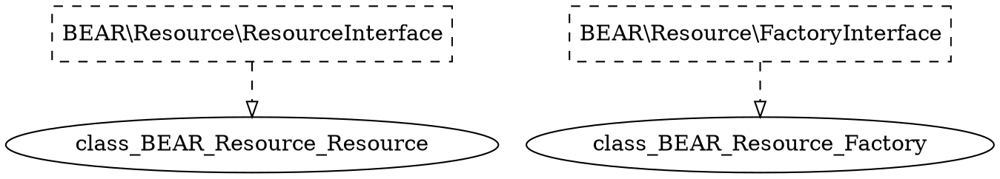

# Ray.Di Complete Manual

このページは、Ray.Diの全ドキュメントを1ページにまとめた包括的なマニュアルです。参照、印刷、オフライン閲覧に便利です。

***
# Installation

Ray.Diのインストールは、[Composer](https://github.com/composer/composer)から行います

```bash
composer require ray/di ^2.0
```

GitHubのリポジトリは[ray-di/Ray.Di](https://github.com/ray-di/Ray.Di)です。

## Testing Ray.Di

Ray.Diをソースからインストールし、ユニットテストとデモを実行する方法を説明します。

```bash
git clone https://github.com/ray-di/Ray.Di.git
cd Ray.Di
./vendor/bin/phpunit
php demo-php8/run.php
```

***

# モチベーション

アプリケーションの開発で、すべてをまとめ上げるのは面倒な作業です。データクラス、サービスクラス、プレゼンテーションクラスを互いに接続するには、いくつかのアプローチがあります。これらのアプローチを対比させるために、ピザの注文サイトの課金コードを書いてみましょう。

```php
interface BillingServiceInterface
{
    /**
    * オーダーをクレジットカードにチャージしようとします。成功した取引と失敗した取引の両方が記録されます。
    *
    * @return Receipt 取引の領収書。チャージが失敗した場合は、理由を説明する断り書きがレシートに記載されます。
    */
    public function chargeOrder(PizzaOrder order, CreditCard creditCard): Receipt;
}
```

実装と並行して、コードの単体テストを書きます。
テストでは、本物のクレジットカードへの課金を避けるために、`FakeCreditCardProcessor`が必要です。

## コンストラクターの直接呼び出し

以下は、クレジットカードプロセッサーとトランザクションロガーを `new` したときのコードです。

```php
class RealBillingService implements BillingServiceInterface
{
    public function chargeOrder(PizzaOrder $order, CreditCard $creditCard): Receipt
    {
        $processor = new PaypalCreditCardProcessor();
        $transactionLog = new DatabaseTransactionLog();

        try {
            $result = $processor->charge($creditCard, $order->getAmount());
            $transactionLog->logChargeResult($result);

            return $result->wasSuccessful()
                ? Receipt::forSuccessfulCharge($order->getAmount())
                : Receipt::forDeclinedCharge($result->getDeclineMessage());
        } catch (UnreachableException $e) {
            $transactionLog->logConnectException($e);

            return Receipt::forSystemFailure($e->getMessage());
        }
    }
}
```

このコードは、モジュール性とテスト容易性の点で問題があります。実際のクレジットカード・プロセッサーに直接依存すると、このコードをテストするとクレジットカードに課金されてしまいます！また、チャージが拒否されたときやサービスが利用できないときに何が起こるかをテストするのは厄介です。

## ファクトリー

ファクトリークラスは、クライアントと実装クラスを切り離します。単純なファクトリーでは、静的メソッドを使用してインターフェースのモック実装を取得したり設定したりします。ファクトリーはいくつかの定型的なコードで実装されます。

```php
class CreditCardProcessorFactory
{
    private static CreditCardProcessor $instance;
    
    public static setInstance(CreditCardProcessor $processor): void 
    {
        self::$instance = $processor;
    }
    
    public static function getInstance(): CreditCardProcessor
    {
        if (self::$instance == null) {
            return new SquareCreditCardProcessor();
        }
        
        return self::$instance;
    }
}
```

クライアントコードでは、`new`の呼び出しをファクトリーの呼び出しに置き換えるだけです。

```php
class RealBillingService implements BillingServiceInterface
{
    public function chargeOrder(PizzaOrder $order, CreditCard $creditCard): Receipt
    {
        $processor = CreditCardProcessorFactory::getInstance();
        $transactionLog = TransactionLogFactory::getInstance();
        
        try {
            $result = $processor->charge($creditCard, $order->getAmount());
            $transactionLog->logChargeResult($result);
            
            return $result->wasSuccessful()
                ? Receipt::forSuccessfulCharge($order->getAmount())
                : Receipt::forDeclinedCharge($result->getDeclineMessage());
        } catch (UnreachableException $e) {
            $transactionLog->logConnectException($e);
            return Receipt::forSystemFailure($e->getMessage());
        }
    }
}
```

ファクトリーを利用することで、適切なユニットテストを書くことが可能になります。

```php
class RealBillingServiceTest extends TestCase 
{
    private PizzaOrder $order;
    private CreditCard $creditCard;
    private InMemoryTransactionLog $transactionLog;
    private FakeCreditCardProcessor $processor;
    
    public function setUp(): void
    {
        $this->order = new PizzaOrder(100);
        $this->creditCard = new CreditCard('1234', 11, 2010);
        $this->processor = new FakeCreditCardProcessor();
        TransactionLogFactory::setInstance($this->transactionLog);
        CreditCardProcessorFactory::setInstance($this->processor);
    }
    
    public function tearDown(): void
    {
        TransactionLogFactory::setInstance(null);
        CreditCardProcessorFactory::setInstance(null);
    }
    
    public function testSuccessfulCharge()
    {
        $billingService = new RealBillingService();
        $receipt = $billingService->chargeOrder($this->order, $this->creditCard);

        $this->assertTrue($receipt->hasSuccessfulCharge());
        $this->assertEquals(100, $receipt->getAmountOfCharge());
        $this->assertEquals($creditCard, $processor->getCardOfOnlyCharge());
        $this->assertEquals(100, $processor->getAmountOfOnlyCharge());
        $this->assertTrue($this->transactionLog->wasSuccessLogged());
    }
}
```

しかしこのコードはあまり良くありません。グローバル変数にはモックの実装が格納されているので、その設定と削除には注意が必要です。もし `tearDown` が失敗したら、グローバル変数は私たちのテストインスタンスを指し続けることになります。これは、他のテストに問題を引き起こす可能性がありますし、複数のテストを並行して実行することもできなくなります。

しかし、最大の問題は依存関係がコードの中に **隠されていること** です。もし私たちが `CreditCardFraudTracker` への依存関係を追加したら、どのテストが壊れるか見つけるためにテストを再実行しなければなりません。もし、プロダクションサービスのファクトリーを初期化するのを忘れた場合、課金が行われるまでそのことに気がつきません。アプリケーションが大きくなるにつれて、ファクトリーの子守は生産性をどんどん低下させることになります。

品質の問題は、QAや受け入れテストによって発見されることは発見されるでしょう。しかし、もっといい方法があるはずです。

## 依存性注入(Dependency Injection)

ファクトリーと同様、依存性注入も単なるデザインパターンに過ぎません。核となる原則は、依存関係の解決から振る舞いを **分離する** ことです。この例では、 `RealBillingService` は `TransactionLog` と `CreditCardProcessor` を探す責任はありません。代わりに、コンストラクターのパラメータとして渡されます。

```php
class RealBillingService implements BillingServiceInterface
{
    public function __construct(
        private readonly CreditCardProcessor $processor,
        private readonly TransactionLog $transactionLog
    ) {}
    
    public function chargeOrder(PizzaOrder $order, CreditCard $creditCard): Receipt
    {
        try {
            $result = $this->processor->charge($creditCard, $order->getAmount());
            $this->transactionLog->logChargeResult($result);
        
            return $result->wasSuccessful()
                ? Receipt::forSuccessfulCharge($order->getAmount())
                : Receipt::forDeclinedCharge($result->getDeclineMessage());
        } catch (UnreachableException $e) {
            $this->transactionLog->logConnectException($e);

            return Receipt::forSystemFailure($e->getMessage());
        }
    }
}
```

ファクトリーは必要ありませんし、`setUp` と `tearDown` の定型的なコードを削除することで、テストケースを簡素化することができます。

```php
class RealBillingServiceTest extends TestCase
{
    private PizzaOrder $order;
    private CreditCard $creditCard;
    private InMemoryTransactionLog $transactionLog;
    private FakeCreditCardProcessor $processor;

    public function setUp(): void
    {
        $this->order = new PizzaOrder(100);
        $this->creditCard = new CreditCard("1234", 11, 2010);
        $this->transactionLog = new InMemoryTransactionLog();
        $this->processor = new FakeCreditCardProcessor();      
    }
    
    public function testSuccessfulCharge()
    {
        $billingService= new RealBillingService($this->processor, $this->transactionLog);
        $receipt = $billingService->chargeOrder($this->order, $this->creditCard);
        
        $this->assertTrue($receipt->hasSuccessfulCharge());
        $this->assertSame(100, $receipt->getAmountOfCharge());
        $this->assertSame($this->creditCard, $this->processor->getCardOfOnlyCharge());
        $this->assertSame(100, $this->processor->getAmountOfOnlyCharge());
        $this->assertTrue($this->transactionLog->wasSuccessLogged());
    }
}
```

これで、依存関係を追加したり削除したりするたびに、コンパイラはどのテストを修正する必要があるかを思い出させてくれるようになりました。依存関係はAPIシグネチャで**公開**されます。（コンストラクターに何が必要かが表されています）

`BillingService` のクライアントはその依存関係を調べないといけないようになってしまいましたが、このパターンをもう一度適用することで修正することができます!  これで必要とするクラスはコンストラクターで `BillingService` サービスを受け入れることができます。トップレベルのクラスでは、フレームワークがあると便利です。そうでなければ、サービスを使う必要があるときに、再帰的に依存関係を構築する必要があります。

```php
<?php
$processor = new PaypalCreditCardProcessor();
$transactionLog = new DatabaseTransactionLog();
$billingService = new RealBillingService($processor, $transactionLog);
// ...
```

## Ray.Diによる依存性注入

依存性注入パターンは、モジュール化されたテスト可能なコードを導き、Ray.Diで簡単にコードを書けるようにします。課金の例でRay.Diを使うには、まずインターフェースとその実装をどのように対応付けるかを指示する必要があります。設定は`Module`インターフェースを実装したRay.Diモジュールクラスで行われます。

```php
class BillingModule extends AbstractModule
{
    protected function configure(): void
    {
        $this->bind(TransactionLog::class)->to(DatabaseTransactionLog::class);
        $this->bind(CreditCardProcessor::class)->to(PaypalCreditCardProcessor::class);
        $this->bind(BillingServiceInterface::class)->to(RealBillingService::class);
    }
}
```

Ray.Diはコンストラクターを検査し、各引数の値を検索します。

```php
class RealBillingService implements BillingServiceInterface
{
    public function __construct(
        private readonly CreditCardProcessor $processor,
        private readonly TransactionLog $transactionLog
    ) {}

    public function chargeOrder(PizzaOrder $order, CreditCard $creditCard): Receipt
    {
        try {
            $result = $this->processor->charge($creditCard, $order->getAmount());
            $this->transactionLog->logChargeResult($result);
        
            return $result->wasSuccessful()
                ? Receipt::forSuccessfulCharge($order->getAmount())
                : Receipt::forDeclinedCharge($result->getDeclineMessage());
        } catch (UnreachableException $e) {
            $this->transactionLog->logConnectException($e);
            
            return Receipt::forSystemFailure($e->getMessage());
        }
    }
}
```

最後にすべてをまとめられ、`Injector`がバインドされたクラスのインスタンスを取得します。

```php
<?php
$injector = new Injector(new BillingModule());
$billingService = $injector->getInstance(BillingServiceInterface::class);
//...

```

[はじめに](getting_started.html) では、この仕組みを説明します。

***

# GettingStarted

_Ray.Di.を使ったDIの始め方_

## はじめに

Ray.Diは、あなたのアプリケーションで依存性注入（DI）パターンを簡単に使用できるようにするフレームワークです。このスタートガイドでは、Ray.Di を使ってアプリケーションに依存性注入を取り入れる方法を簡単な例で説明します。

### 依存性注入とは何ですか？

[依存性注入 (dependency injection)](https://ja.wikipedia.org/wiki/依存性の注入)は、クラスが依存関係を直接作成するのではなく、引数として宣言するデザインパターンです。あるサービスを呼び出したいクライアントはサービスを構築する方法を知る必要はなく、外部のコードがクライアントにサービスを提供する役割を担います。

依存性注入を使用しないコードの例を簡単な示します。

```php
class Foo
{
    private Database $database;  // 仕事を完了させるためにはデータベースが必要
    
    public function __construct()
    {
        // うっ。どうやってテストすればいいんでしょうか？
        // 他のアプリケーションで別のデータベースを使いたい場合はどうすればいいのでしょうか？
        $this->database = new Database('/path/to/my/data');
    }
}
```

上記の `Foo` クラスは、固定の `Database` オブジェクトを直接作成します。このため、このクラスを他の `Database` オブジェクトと一緒に使うことはできません。また、テスト時に実際のデータベースをテスト用のデータベースと交換することもできません。テストできないコードや柔軟性に欠けるコードを書く代わりに、依存性注入パターンを使用することで、これらの問題すべてに対処することができます。

以下は同じ例で、今回は依存性注入を使用しています。

```php
class Foo {
    private Database $database;  //　仕事を完了させるためにはデータベースが必要
    
    public function __construct(Database $database)
    {
        // データベースは別のところから来ている。どこかって？それは私の仕事ではありません。
        // どのデータベースを使うかは、私を構築する人の仕事です。
        $this->database = $database;
    }
}
```

上記の `Foo` クラスは、`Database` がどのように作成されたかを知らないので、任意の `Database` オブジェクトを使用することができます。例えば、テスト用にインメモリデータベースを使用する `Database` の実装を作成すると、テストの密閉性と高速性を高めることができます。

[モチベーション](Motivation.md) ページでは、アプリケーションが依存性注入パターンを使用すべき理由について、より詳しく説明しています。

## Ray.Diのコアコンセプト

### コンストラクター

PHPクラスのコンストラクターは、[コンストラクターインジェクション](Injections.md#constructor-injection)という処理によってRay.Diから呼び出すことができ、その際にコンストラクターの引数はRay.Diによって作成・提供されることになります。(Guiceとは異なり、Ray.Diはコンストラクターに`Inject`アノテーションを必要としません)

以下は、コンストラクターインジェクションを使用するクラスの例です。

```php
class Greeter
{
    // Greeterは、文字列メッセージと、メッセージを表示する回数を表す整数が必要であると宣言しています。
    public function __construct(
        #[Message] readonly string $message,
        #[Count] readonly int $count
    ) {}

    public function sayHello(): void
    {
        for ($i=0; $i < $this->count; $i++) {
            echo $message;
        }
    }
}
```

上記の例の`Greeter` にはコンストラクターがあり、Ray.Diが`Greeter`のインスタンスを作成する時に呼び出されます。Ray.Diはそのために必要な2つの引数を作成し、それからコンストラクターを呼び出します。`Greeter`クラスのコンストラクターの引数は依存関係にあり、アプリケーションは `Module` を使用して Ray.Di に依存関係を解決する方法を伝えます。

### Ray.Di モジュール

アプリケーションには、他のオブジェクトへの依存を宣言するオブジェクトが含まれ、それらの依存関係でグラフを形成します。例えば、上記の `Greeter` クラスは 2 つの依存関係を持っているのがコンストラクターで宣言されています。

* プリントされるメッセージのための `string` 値
* メッセージをプリントする回数を示す `int` 値

Ray.Diモジュールでは、これらの依存関係を満たす方法をアプリケーションで指定することができます。例えば、以下の `DemoModule` は `Greeter` クラスに必要なすべての依存関係を設定しています。

```php
class CountProvider implements ProviderInterface
{
    public function get(): int
    {
        return 3;
    }
}

class MessageProvider implements ProviderInterface
{
    public function get(): string
    {
        return 'hello world';
    }
}

/**
 * メッセージとカウントの束縛を提供するRayDiモジュール
 */
class DemoModule extends AbstractModule
{
    protected function configure(): void
    {
        $this->bind()->annotatedWith(Count::class)->toProvider(CountProvider::class);
        $this->bind()->annotatedWith(Message::class)->toProvider(MessageProvider::class);
    }
}
```

実際のアプリケーションでは、オブジェクトの依存関係グラフはもっと複雑になりますが、Ray.Diはすべての推移的依存関係[^transitive_dependencies]を自動的に作成し、複雑なオブジェクトを簡単に作成することができます。

[^transitive_dependencies]: 推移的依存関係とは、プログラムが直接参照するコンポーネントによって誘発される依存関係のことです。例えば、log()関数の呼び出しは、通常、ログメッセージをファイルに書き込むためのI/Oを管理するライブラリへの"推移的依存関係"を誘発します。☞ [Transitive_dependency](https://en.wikipedia.org/wiki/Transitive_dependency)

### Ray.Diインジェクター

アプリケーションをブートストラップするために、1つ以上のモジュールを含む Ray.Di `Injector` を作成する必要があります。例えば、ウェブサーバースクリプトは以下のようなものでしょう。

```php
final class MyWebServer {
    public function __construct(
        private readonly RequestLoggingInterface $requestLogging,
        private readonly RequestHandlerInterface $requestHandler,
        private readonly AuthenticationInterface $authentication,
        private readonly Database $database
    ) {}

    public function start(): void
    {
        //　...
    }
    
    
    public function __invoke(): void
    {
        // サーバーを構築するために必要なすべての依存関係を持つインジェクターを作成します。
        $injector = new Injector(new class extends AbstractModule {
            protected function configure(): void
            {
                $this->install(new RequestLoggingModule());
                $this->install(new RequestHandlerModule());
                $this->install(new AuthenticationModule());
                $this->install(new DatabaseModule());
            }
        });
    
        // サーバーのインスタンスを作成してアプリケーションをブートストラップし
        // 受信したリクエストを処理するためにサーバーを開始します。
        $injector->getInstance(MyWebServer::class)->start();
    }
}

(new MyWebServer)();
```

インジェクターは、アプリケーションで記述された依存関係グラフを内部で保持します。指定した型のインスタンスを要求すると、インジェクターはどのオブジェクトを作成すべきかを判断し、依存関係を解決してすべてを結びつけます。依存関係の解決方法を指定するために、[束縛](bindings.html)を使用してインジェクターを設定します。

## シンプルなRay.Diアプリケーション

以下は、必要なものをまとめたシンプルなRay.Diアプリケーションです。

```php
<?php
require __DIR__ . '/vendor/autoload.php';

use Ray\Di\AbstractModule;
use Ray\Di\Di\Qualifier;
use Ray\Di\ProviderInterface;
use Ray\Di\Injector;

#[Attribute, Qualifier]
class Message
{
}

#[Attribute, Qualifier]
class Count
{
}

class CountProvider implements ProviderInterface
{
    public function get(): int
    {
        return 3;
    }
}

class MessageProvider implements ProviderInterface
{
    public function get(): string
    {
        return 'hello world';
    }
}

class DemoModule extends AbstractModule
{
    protected function configure()
    {
        $this->bind()->annotatedWith(Count::class)->toProvider(CountProvider::class);
        $this->bind()->annotatedWith(Message::class)->toProvider(MessageProvider::class);
    }
}

class Greeter
{
    public function __construct(
        #[Message] private string $message,
        #[Count] private int $count
    ) {}

    public function sayHello(): void
    {
        for ($i = 0; $i < $this->count ; $i++) {
            echo $this->message . PHP_EOL;
        }
    }
}

/*
 * インジェクターのコンストラクターは、モジュールを受け取ります。
 * ほとんどのアプリケーションは、起動時にこのメソッドを一度だけ呼び出します。
 */
$injector = new Injector(new DemoModule);

/*
 * 入手したインジェクターで、オブジェクトを作成します。
 */
$greeter = $injector->getInstance(Greeter::class);

// コンソールに 'hello world'を3回表示。
$greeter->sayHello();
```

[greeter](https://github.com/ray-di/greeter/blob/master/greeter.php) アプリケーションは、`Greeter` クラスのインスタンスを構築することができる Ray.Di を使用して小さな依存関係グラフを構築しています。通常、大規模なアプリケーションは複雑なオブジェクトを構築することができる多くの `Module` を持っています。

## 次に

シンプルな [メンタルモデル](mental_model.html)でRay.Diをもっと深く理解する方法を探索してください。

---

***

# Ray.Di メンタルモデル

_`Key`や`Provider`、それにRay.Diがどうのようにして単なるマップと考えられるかについて_

依存性注入（Dependency Injection）について調べていると、多くのバズワード（"制御の反転"、"ハリウッド原則"、"インジェクション"）を目にし混乱することがあります。しかし、依存性注入という専門用語に対してコンセプトはそれほど複雑ではありません。実際、あなたはすでによく似たことを書いているかもしれません。
このページでは、Ray.Diの実装の簡略化されたモデルについて説明しどのように働くかの理解を助けます。

## Ray.Diはマップ

基本的にRay.Diは、アプリケーションが使用するオブジェクトの作成と取得を支援します。アプリケーションが必要とするこれらのオブジェクトは **依存や依存性(dependencies)** と呼ばれます。

Ray.Diはマップ[^raydi-map]であると考えることができます。アプリケーションのコードが必要な依存関係を宣言すると、Ray.Diはそのマップからそれらを取得します。"Ray.Diマップ"の各エントリーは、2つの部分から構成されています。

*   **Ray.Di キー**: マップから特定の値を取得するために使用されるマップのキー
*   **プロバイダー**: アプリケーションのオブジェクトを作成するために使用されるマップの値

[^raydi-map]: [PHPの配列](https://www.php.net/manual/ja/language.types.array.php)はマップです。また、Ray.Diの実際の実装ははるかに複雑ですが、マップはRay.Diがどのように動作するかおおよそを表しています。

### Ray.Diキー

Ray.Diは`Key`を使って、Ray.Diマップから依存関係を解決します。

[はじめに](getting_started.html) で使用されている `Greeter` クラスは、コンストラクターで2つの依存関係を宣言していて、それらの依存関係は Ray.Di では `Key` として表されます。

*   `#[Message] string` --> `$map[$messageKey]`
*   `#[Count] int` --> `$map[$countKey]`

最も単純な形の `Key` は、PHP の型で表されます。

```php
// 依存(文字列)を特定
/** @var string $databaseKey */
$databaseKey = $map[$key];
```

しかし、アプリケーションには同じ型の依存関係があることがあります。

```php
class Message
{
    public function __construct(
    	  public readonly string $text
    ){}
}

class MultilingualGreeter
{
    public function __construct(
      private readonly Message $englishGreeting,
      private readonly Message $spanishGreeting
    ) {}
}
```

Ray.Diでは、同じタイプの依存関係を区別するために、[アトリビュート束縛](binding_attributes.htnl) を使用しています。

```php
class MultilingualGreeter
{
    public function __construct(
      #[English] private readonly Message $englishGreeting,
      #[Spanish] private readonly Message $spanishGreeting
    ) {}
}
```

束縛アノテーションを持つ `Key` は、次のように作成することができます。

```php
$englishGreetingKey = $map[Message::class . English::class];
$spanishGreetingKey = $map[Message::class . Spanish::class];
```

アプリケーションが `$injector->getInstance(MultilingualGreeter::class)` を呼び出したとき、
`MultilingualGreeter`のインスタンスを生成しますが、以下と同じ事を行っています。

```php
// Ray.Diは内部でこれを行うので、手動でこれらの依存関係を解決する必要はありません。
$english = $injector->getInstance(Message::class, English::class));
$spanish = $injector->getInstance(Message::class, Spanish::class));
$greeter = new MultilingualGreeter($english, $spanish);
```

つまり**Ray.Diの `Key` はPHPの型と依存関係を識別するためのアトリビュート（オプション）を合わせたものです**。

### Ray.Diプロバイダー

Ray.Diでは依存関係を満たすオブジェクトを生成するファクトリーのために、"Ray.Diマップ"で[`ProviderInterface`](https://github.com/ray-di/Ray.Di/blob/2.x/src/di/ProviderInterface.php)を使用します。

`Provider` は単一のメソッドを持つインターフェースです。

```php
interface ProviderInterface
{
  /** インスタンスを用意する */
  public function get();
}
```

`ProviderInterface` を実装している各クラスは、 インスタンスを生成する方法を知っている簡単なコードです。`new`を呼び出したり、他の方法で依存を構築したり、キャッシュから事前に計算されたインスタンスを返したりすることができます。値の型は限定されずmixedです。

以下は 2 つの `ProviderInterface` の実装例です。

```php
class CountProvider implements ProviderInterface
{
    public function get(): int
    {
        return 3;
    }
}

class MessageProvider implements ProviderInterface
{
    public function get(): string
    {
        return 'hello world';
    }
}

class DemoModule extends AbstractModule
{
   protected function configure(): void
   {
       $this->bind()->annotatedWith(Count::class)->toProvider(CountProvider::class);
       $this->bind()->annotatedWith(Message::class)->toProvider(MessageProvider::class);
   }
}
```

*   `MessageProvider`の`get()`メソッドが呼び出され 'hello world’を返します。
*   `CountProvider`の`get()` メソッドが呼び出され3を返します。

## Ray.Diの使用

Ray.Diの利用には2つのパートがあります。

1.  **コンフィギュレーション**：アプリケーションが"Ray.Diマップ"に何か追加します。
1.  **インジェクション**：アプリケーションがRay.Diにマップからのオブジェクトの作成と取得を依頼します。

以下に説明します。

### コンフィギュレーション

Ray.Diのマップは、Ray.Diモジュールを使って設定されます。**Ray.Diモジュール**は、Ray.Diマップに何かを追加する設定ロジックユニットです。Ray.Di ドメイン固有言語（DSL）を使用して設定を行います。

これらのAPIは単にRay.Dマップを操作する方法を提供するものです。これらのAPIが行う操作は簡単で、以下は簡潔なPHPのシンタックスを使用した説明です。

| Ray.Di DSL シンタックス                   | メンタルモデル                                                                       |
| ---------------------------------- | ---------------------------------------------------------------------------------- |
| `bind($key)->toInstance($value)`  | `$map[$key] = $value;`  <br>(インスタンス束縛)          |
| `bind($key)->toProvider($provider)` | `$map[$key] = fn => $value;` <br>(プロバイダー束縛) |
| `bind(key)->to(anotherKey)`       | `$map[$key] = $map[$anotherKey];` <br>(リンク束縛) |

`DemoModule` は Ray.Di マップに2つのエントリーを追加します。

*   `#[Message] string` --> `(new MessageProvider())->get()`
*   `#[Count] int` --> `(new CountProvider())->get()`

### インジェクション

マップから物事を **プル** するのではなく、それらが必要であることを **宣言** します。これが依存性注入の本質です。何かが必要なとき、どこかからそれを取りに行ったり、クラスから何かを返してもらったりすることはありません。その代わりにあなたは単にそれなしでは仕事ができないと宣言し、必要とするものを与えるのがRay.Diの役割です。

このモデルは、多くの人がコードについて考える方法とは逆で、「命令的」ではなく「宣言的」なモデルと言えます。依存性注入がしばしば一種の**[制御の反転](https://ja.wikipedia.org/wiki/制御の反転)** (IoC)と表されるのはこのためです。

何かを必要とすることを宣言するにはいくつか方法があります。

1. コンストラクターの引数:

    ```php
    class Foo
    {
      // どこからかデータベースが必要
      public function __construct(
            private Database $database
       ) {}
    }
    ```

2. `Provider`コンストラクターの引数

    ```php
    class DatabaseProvider implements ProviderInterface
    {
        public function __construct(
            #[Dsn] private string $dsn
        ){}
      
        public function get(): Database
        {
            return new Database($this->dsn);
        }
    }
    ```

この例は、[はじめに](getting_started.html)のサンプルFooクラスと同じです。

注：Ray.Di は Guice とは異なり、コンストラクターに _Inject_は必要はありません。

## 依存関係がグラフを形成

それ自体に依存性があるものを注入する場合、Ray.Diは再帰的に依存関係を注入します。上記のような `Foo` のインスタンスをインジェクトするために、Ray.Di は以下のような `ProviderInterface` の実装を作成することが考えられます。

```php
class FooProvider implements ProviderInterface
{
    public function get(): Foo
    {
        global $map;
        
        $databaseProvider = $map[Database::class]);
        $database = $databaseProvider->get();
        
        return new Foo($database);
    }
}

class DatabaseProvider implements Provider
{
    public function get(): Database
    {
        global $map;
        
        $dsnProvider = $map[Dsn::class];
        $dsn = $dsnProvider->get();
        
        return new Database($dsn);
    }
}  

class DsnProvider implements Provider
{
    public function get(): string
    {
        return getenv(DB_DSN);
    }
}  
```

依存関係は **有向グラフ[^direct-graph]** を形成し、インジェクションは、必要なオブジェクトからそのすべての依存関係を介してグラフの[深さ優先探索](https://ja.wikipedia.org/wiki/深さ優先探索)を実行することによって動作します。

[^direct-graph]: 頂点と向きを持つ辺（矢印）により構成された[グラフ](https://ja.wikibooks.org/wiki/グラフ理論)です。

Ray.Di の `Injector` オブジェクトは、依存関係グラフ全体を表します。`インジェクター`を作成するために、Ray.Diはグラフ全体が動作することを検証する必要があります。依存関係が必要なのに提供されていない「ぶら下がり」ノードがあってはいけません[^3] もしグラフのどこかで束縛が不完全だと、Ray.Di は `Unbound` 例外を投げます。

[^3]: その逆もまた然りで、何も使わなくても、何かを提供することは問題ありません。とはいえ、デッドコードと同じように、どこからも使われなくなったプロバイダーは削除するのが一番です。

## 次に

Ray.Di が作成したオブジェクトのライフサイクルを管理するための [Scopes](scopes.html) の使い方と、さまざまな[Ray.Di マップにエントリを追加](bindings.html)する方法について学びましょう。

---

***

# Scopes

デフォルトでは、Ray.Diは値を供給するたびに新しいインスタンスを返します。この動作は、スコープで設定可能です。

```php
use Ray\Di\Scope;
```
```php
$this->bind(TransactionLogInterface::class)->to(InMemoryTransactionLog::class)->in(Scope::SINGLETON);
```

***

# Bindings
_Ray.Diにおける束縛の概要_

**束縛**とは、[Ray.Di map](mental_model.html) のエントリに対応するオブジェクトのことです。束縛を作成することで、Ray.Diマップに新しいエントリーを追加できます。

## 束縛の作成

束縛を作成するには、`AbstractModule` を継承して `configure` メソッドをオーバーライドします。メソッド本体では、`bind()` を呼び出してそれぞれの束縛を指定します。これらのメソッドはコンパイル時に型チェックを行い、間違った型を使用した場合はエラーを報告します。モジュールを作成したら、それを `Injector` に引数として渡し、インジェクターを構築します。

モジュールを使って、[リンク束縛](linked_bindings.html)、 [インスタンス束縛](instance_bindings.html)、 [プロバイダー束縛](provider_bindings.html)、 [コンストラクター束縛](constructor_bindings.html)、 [アンターゲット束縛](untargeted_bindings.html)を作成しましょう。

```php
class TweetModule extends AbstractModule
{
    protected function configure()
    {
        $this->bind(TweetClient::class);
        $this->bind(TweeterInterface::class)->to(SmsTweeter::class)->in(Scope::SINGLETON);
        $this->bind(UrlShortenerInterface)->toProvider(TinyUrlShortener::class);
        $this->bind('')->annotatedWith(Username::class)->toInstance("koriym");
    }
}
```

## その他の束縛

インジェクターは指定した束縛の他に [ビルトイン束縛](builtin_bindings.html) と [プロバイダー注入](injecting_providers.html) の束縛も含みます。

## モジュールのインストール

モジュールは、他のモジュールをインストールすることで、より多くの束縛を設定できます。

* 同じ束縛が後から作られた場合、先に作られた束縛が優先されます。
* そのモジュールの `override` 束縛が優先されます。

```php
protected function configure()
{
    $this->install(new OtherModule);
    $this->override(new CustomiseModule);
}
```

***

## リンク束縛

リンク束縛は、型とその実装をマッピングします。この例では、インターフェース TransactionLogInterface を実装 DatabaseTransactionLog にひもづけています。

```php
$this->bind(TransactionLogInterface::class)->to(DatabaseTransactionLog::class);
```

***

# 束縛アトリビュート

場合によっては、同じ型複数の束縛が必要になることがあります。たとえば、PayPalのクレジットカード決済と Google Checkoutの決済の両方を行いたい場合などです。
## 束縛アトリビュートの定義
このような場合に備えて、オプションの束縛アトリビュートという束縛が用意されています。このアトリビュートと型を組み合わせることで、束縛を一意に識別します。

### 束縛アトリビュートの定義

束縛アトリビュートは `Qualifier` アトリビュートが付与されたPHPのアトリビュートです。

```php
use Ray\Di\Di\Qualifier;

#[Attribute, Qualifier]
final class PayPal
{
}
```

指定した束縛に依存するには、注入されるパラメータにそのアトリビュートを割り当てます。

```php
public function __construct(
    #[Paypal] private readonly CreditCardProcessorInterface $processor
){}
```

最後に、そのアトリビュートを使用する束縛を作成します。これは`bind()` 文のオプションの`annotatedWith` 節を使用します。

```php
$this->bind(CreditCardProcessorInterface::class)
  ->annotatedWith(PayPal::class)
  ->to(PayPalCreditCardProcessor::class);
```

## #[Named]

`Qualifier` アトリビュートの最も一般的な使用法は、メソッドの引数に特定のラベルを付けることです。このラベルは、インスタンス化するクラスを正しく選択するために束縛で使用されます。

カスタムの`Qualifier` アトリビュートを作成する他に、Ray.Diには文字列を受け取るビルトインの束縛アトリビュート`#[Named]` が用意されています。

```php
use Ray\Di\Di\Inject;
use Ray\Di\Di\Named;

public function __construct(
    #[Named('checkout')] private CreditCardProcessorInterface $processor
){}
```

特定の名前をバインドするには、`annotatedWith()` メソッドを用いてその文字列を渡します。

```php
$this->bind(CreditCardProcessorInterface::class)
    ->annotatedWith('checkout')
    ->to(CheckoutCreditCardProcessor::class);
```

パラメータを指定するには、`#[Named]` アトリビュートを付ける必要があります。

```php
use Ray\Di\Di\Inject;
use Ray\Di\Di\Named;

public function __construct(
    #[Named('checkout')] private CreditCardProcessorInterface $processor,
    #[Named('backup')] private CreditCardProcessorInterface $subProcessor
){}
```

## カスタムインジェクターアトリビュート

通常、セッターインジェクションで束縛アトリビュートを行う時は`#[Inject]` アトリビュートと束縛アトリビュートの２つが必要です。これをカスタムインジェクターアトリビュートを使って１つにすることができます。

カスタムインジェクターアトリビュートは`InjectInterface` を実装する必要があります。

```php
use Ray\Di\Di\InjectInterface;
use Ray\Di\Di\Qualifier;

#[Attribute, Qualifier]
final class PaymentProcessorInject implements InjectInterface
{
    public function isOptional()
    {
        return $this->optional;
    }
    
    public function __construct(
        public readonly bool $optional = true
        public readonly string $type;
    ){}
}
```

このインターフェースでは、`isOptional()` メソッドの実装が必須です。このメソッドを実行するかどうかは、その束縛が存在するかどうかで決定されます。

これでカスタムインジェクターアトリビュートが作成できたので、任意のメソッドで使用することができます。

```php
#[PaymentProcessorInject(type: 'paypal')]
public setPaymentProcessor(CreditCardProcessorInterface $processor)
{
 ....
}
```

最後に、新しいアノテーション情報を使って、インターフェースを実装にバインドすることができます。

```php
$this->bind(CreditCardProcessorInterface::class)
    ->annotatedWith(PaymentProcessorInject::class)
    ->toProvider(PaymentProcessorProvider::class);
```


## 束縛アノテーション

Ray.DiはPHP7.xのために [doctrine/annotation](https://github.com/doctrine/annotations) と共に使用できます。アノテーションコードの例は古い[README(v2.10)](https://github.com/ray-di/Ray.Di/tree/2.10.5/README.md)をご覧ください。アトリビュートに対する前方互換性のあるアノテーションを作成するには、 [カスタムアノテーションクラス](https://github.com/kerveros12v/sacinta4/blob/e976c143b3b7d42497334e76c00fdf38717af98e/vendor/doctrine/annotations/docs/en/custom.rst#optional-constructors-with-named-parameters) を参照してください。

アノテーションは引数に対して適用することができないので、カスタムアノテーションの最初の引数に変数名を指定します。なおメソッドに引数が１つのしかない場合には不要です。

```php
/**
 * @Paypal('processor')
 */
public function setCreditCardProcessor(
    CreditCardProcessorInterface $processor
    OtherDepedeciyInterface $depedency
){
```

***

## インスタンス束縛

ある型をその型のインスタンスに束縛できます。これは通常、値オブジェクトのような、それ自体に依存性がないオブジェクトにのみ使用します。

```php
$this->bind(UserInterface::class)->toInstance(new User);
```

```php
$this->bind()->annotatedWith('login_id')->toInstance('bear');
```

作成が複雑なオブジェクトではインスタンス束縛を使用しないようにしてください。インスタンスはシリアライズ保存されるので、シリアライズ不可能なものはインスタンス束縛を使う事ができません。代わりにプロバイダー束縛を使用することができます。

***

## プロバイダー束縛

プロバイダー束縛は型に対してそのプロバイダーをマッピングします。

```php
$this->bind(TransactionLogInterface::class)->toProvider(DatabaseTransactionLogProvider::class);
```
プロバイダーは `ProviderInterface` を実装しています。このインターフェースは値を供給するだけのシンプルなインターフェースです。

```php
namespace Ray\Di;

interface ProviderInterface
{
    public function get();
}
```
プロバイダーはそれ自身でも依存性を持っており、コンストラクターを介して依存性を受け取ります。  
以下の例では `ProviderInterface` を実装し、型の安全性が保証された値を返します。

```php

use Ray\Di\Di\Inject;
use Ray\Di\ProviderInterface;

class DatabaseTransactionLogProvider implements ProviderInterface
{
    public function __construct(
        private readonly ConnectionInterface $connection)
    ){}

    public function get()
    {
        $transactionLog = new DatabaseTransactionLog;
        $transactionLog->setConnection($this->connection);

        return $transactionLog;
    }
}
```

最後に `toProvider()` メソッドを用いてプロバイダーを束縛します。

```php
$this->bind(TransactionLogInterface::class)->toProvider(DatabaseTransactionLogProvider::class);
```

## インジェクションポイント

`InjectionPoint`オブジェクトは、注入が行われる箇所（インジェクションポイント）のメタ情報を持つクラスです。プロバイダーは、注入箇所のクラス名や変数名などのインジェクションポイントのメタデータを使って依存インスタンスを作成する事ができます。

### 例：インスタンス生成にインジェクションポイントのクラス名を使用

インジェクションポイントのクラス名を`$this->ip->getClass()->getName()`で取得して依存インスタンスを生成しています。

```php
class Psr3LoggerProvider implements ProviderInterface
{
    public function __construct(
        private InjectionPointInterface $ip
    ){}

    public function get()
    {
        $logger = new \Monolog\Logger($this->ip->getClass()->getName());
        $logger->pushHandler(new StreamHandler('path/to/your.log', Logger::WARNING));

        return $logger;
    }
}
```
`InjectionPointInterface` は以下のメソッドを提供します。

```php
$ip->getClass();      // \ReflectionClass
$ip->getMethod();     // \ReflectionMethod
$ip->getParameter();  // \ReflectionParameter
$ip->getQualifiers(); // (array) $qualifierAnnotations
```

***

## アンターゲット束縛

具象クラスの束縛に用います。インジェクターに型に関する情報を提供し、依存関係を準備することができます。アンターゲット束縛には `to()` 節がありません。

```php
$this->bind(MyConcreteClass::class);
$this->bind(AnotherConcreteClass::class)->in(Scope::SINGLETON);
```

注：現在、アンターゲット束縛は`annotatedWith()`節をサポートしていません。

***

## コンストラクター束縛

時には対象のコンストラクターやセッターメソッドがサードパーティ製であるため`#[Inject]`アトリビュートが適用できない場合や、あるいは単にアトリビュートを使いたくない場合があります。

コンストラクター束縛はこの問題を解決します。つまり、対象となるコンストラクターの情報をアトリビュートではなく、ユーザー側で明示的に指定することでRay.DIにオブジェクトの生成方法を伝えます。

```php
$this->bind($interfaceName)
    ->toConstructor(
        $className,       // Class name
        $name,            // Qualifier
        $injectionPoint,  // Setter injection
        $postConstruct    // Initialize method
    );

(new InjectionPoints) 
    ->addMethod('setGuzzle')                 // Setter injection method name
    ->addOptionalMethod('setOptionalToken'); // Optional setter injection method name
```

### Parameter

**class_name**

クラス名

**name**

パラメーター名束縛

引数に識別子を追加する場合は、キーを変数名、値を識別子とする配列を指定します。

```php
[
	[$paramName1 => $named1],
	[$paramName2 => $named2],
	...
]
```

以下のストリングフォーマットもサポートされています。
`'param_name1=binding_name1&...'`

**setter_injection**

`InjectionPoints`オブジェクトでセッターインジェクションのメソッド名($methodName)と識別子($named)を指定します。

```php
(new InjectionPoints)
	->addMethod($methodName1)
	->addMethod($methodName2, $named)
  ->addOptionalMethod($methodName, $named);
```

**postCosntruct**

コンストラクターとセッターメソッドが呼び出され、すべての依存関係が注入された後に`$postCosntruct`メソッドが呼び出されます

### PDO Example

[PDO](http://php.net/manual/ja/pdo.construct.php)クラスの束縛の例です。

```php
public PDO::__construct(
    string $dsn,
    ?string $username = null,
    ?string $password = null,
    ?array $options = null
)
```

```php
$this->bind(\PDO::class)->toConstructor(
    \PDO::class,
    [
        'dsn' => 'pdo_dsn',
        'username' => 'pdo_username',
        'password' => 'pdo_password'
    ]
)->in(Scope::SINGLETON);

$this->bind()->annotatedWith('pdo_dsn')->toInstance($dsn);
$this->bind()->annotatedWith('pdo_username')->toInstance(getenv('db_user'));
$this->bind()->annotatedWith('pdo_password')->toInstance(getenv('db_password'));
```

PDOのコンストラクター引数は`$dsn`, `$username`などstringの値を受け取り、その束縛を区別するために識別子が必要です。しかしPDOはPHP自体のビルトインクラスなのでアトリビュートを加えることができません。

`toConstructor()`の第2引数の`$name`で識別子(qualifier)を指定します。その識別子に対してあらためて束縛を行います。
上記の例では`username`という変数に`pdo_username`と言う識別子を与え、`toInstance`で環境変数の値を束縛しています。

***

# ビルトイン束縛

_その他の使用可能な束縛について_

**注意**: これらのビルトイン束縛を使用する必要は稀です。

## インジェクター

フレームワークのコードでは、実行時まで必要な型がわからないことがあります。このまれなケースでは、インジェクターを注入する必要があります。インジェクターを注入するコードは、その依存関係を自己文書化しないので、この方法は控えめにすべきです。

## プロバイダー

Ray.Diが知っているすべての型について、その型のプロバイダーを注入することが出来ます。
[プロバイダー注入](provider_bindings.html)で詳しく説明されています。

## マルチ束縛

プロバイダー束縛は、型に対して複数の実装を注入することが出来ます。
[マルチ束縛](multibindings.html)で詳しく説明されています。

***

# マルチ束縛

_マルチバインダー, マップバインダー の概要_

Multibinderは、プラグインタイプのアーキテクチャを想定しています。

### マルチバインダー

マルチ束縛は、アプリケーションのプラグインを簡単にサポートすることができます。[IDE](https://plugins.jetbrains.com/phpstorm) や [ブラウザ](https://chrome.google.com/webstore/category/extensions) によって普及したこのパターンは、アプリケーションの動作を拡張するためのAPIを公開します。

プラグインの利用者もプラグインの作成者も、Ray.Diを使った拡張可能なアプリケーションのために多くのセットアップコードを書く必要はありません。単にインターフェースを定義し、実装をバインドし、実装のセットをインジェクトするだけです。どのモジュールも新しい マルチバインダーを作成し、実装のセットの束縛を提供することができます。例として、`http://bit.ly/1mzgW1` のような醜いURIをTwitterで読みやすいように要約するプラグインを使ってみましょう。

まず、プラグインの作者が実装できるインタフェースを定義します。これは通常、いくつかの種類の実装が可能なインターフェースです。例としてWebサイトごとに異なる、URIを短縮する実装を書いてみます。

```php
interface UriSummarizerInterface
{
    /**
     * 短縮URIを返す。このsummarizerがURIの短縮方法を知らない場合はnullを返す。
     */
    public function summarize(Uri $uri): string;
}
```

次に、プラグインの作者にこのインターフェースを実装してもらいます。以下はFlickrに写真URLを短縮する実装です。

```php
class FlickrPhotoSummarizer implements UriSummarizer
{
    public function __construct(
        private readonly PhotoPaternMatcherInterface $matcher
    ) {}

    public function summarize(Uri $uri): ?string
    {
        $match = $this->matcher->match($uri);
        if (! $match) {
            return null;
        }
        $id = $this->matcher->group(1);
        $photo = Photo::loockup($id);

        return $photo->getTitle();
    }
  }
}
```

プラグイン作者は、マルチバインダを使用して実装を登録します。プラグインによっては、複数の実装を束縛したり、複数の拡張点のインタフェースの実装を束縛することがあります。

```php
class FlickrPluginModule extends AbstractModule
{
    public function configure(): void 
    {
        $uriBinder = Multibinder::newInstance($this, UriSummarizerInterface::class);
        $uriBinder->addBinding()->to(FlickrPhotoSummarizer::class);

        // ...その他、Flickr API キーなど、プラグインの依存性を束縛
   }
}
```

これで、プラグインが公開するサービスを利用できるようになりました。今回はツイートのURIを短縮しています。

```php
class TweetPrettifier
{
    /**
     * @param Map<UriSummarizerInterface> $summarizers
     */
    public function __construct(
        #[Set(UriSummarizerInterface::class)] private readonly Map $summarizers,
        private readonly EmoticonImagifier $emoticonImagifier
    ) {}
    
    public function prettifyTweet(String tweetMessage): Html
    {
        // URIを分割し、それぞれに対してprettifyUri()を呼び出します。
    }

    public function prettifyUri(Uri $uri): string
    {
        // 実装をループし、このURIをサポートするものを探します
        for ($this->summarizer as summarizer) {
            $summary = $summarizer->summarize($uri);
            if ($summary != null) {
                return $summary;
            }
       }

        // URI短縮が見つからない場合は、URIそのものを返します。
        return $uri->toString();
    }
}
```

> **Note:** `Multibinder::newInstance($module, $type)` というメソッドについて
>
>この操作は、新しいバインダを作成しますが、 既存のバインダを上書きすることはありません。この方法で作成されたバインダーで対象の型に対して実装群を加えます。
新しいバインダを作成するのは、バインダがまだ存在しない場合だけです。

最後にプラグインを登録する必要があります。

```php
class PrettyTweets
{
    public function __invoke(): void
    {
        $injector = new Injector(
            new class extends AbstractModule {
                protected function configure(): void
                {
                    $this->install(new TweetModule());
                    $this->install(new FlickrPluginModule());
                    $this->install(new GoogleMapsPluginModule());
                    $this->install(new BitlyPluginModule());
                    // ... any other plugins
                }
            }
        );

        $injector->getInstance(Frontend::class)->start();
  }
}
(new PrettyTweets)();
```

### マップバインダー

マルチバインダーで追加するクラスに名前をつけることができます。ここでは'flickr'という名前をつけました。

```php
class FlickrPluginModule extends AbstractModule
{
    public function configure(): void 
    {
        $uriBinder = Multibinder::newInstance($this, UriSummarizerInterface::class);
        $uriBinder->addBinding('flickr')->to(FlickrPhotoSummarizer::class);

        // ...bind plugin dependencies, such as our Flickr API key
   }
}
```

アプリケーションでは`#[Set(UriSummarizer::class)]`などとアトリビュート指定して注入された`Map`を、束縛で指定しと時の名前で取り出すことができます。

```php

class TweetPrettifier
{
    /**
     * @param Map<UriSummarizerInterface> $summarizers
     */
    public function __construct(
        #[Set(UriSummarizer::class)] private readonly Map $summarizers
    ) {}

    public function doSomething(): void
    {
        $flickrSummarizer = $this->summarizers['flickr'];
        assert($flickrSummarizer instanceof FlickrPhotoSummarizer);
    }    
}
```

マップバインダーは名前をつけて取り出しやすくしただけで、マルチバインダーとほとんど同じです。

## セット束縛

`setBinding()`はそれまでの束縛を上書きします。

```php
$uriBinder = Multibinder::newInstance($this, UriSummarizerInterface::class);
$uriBinder->setBinding('flickr')->to(FlickrPhotoSummarizer::class);
```

## Map

`Map`オブジェクトは静的解析ではジェネリクスとして扱われます。注入されるインターフェースがTなら `Map<T>` のように記述します。

```php
/** @param Map<UriSummarizerInterface> $summarizers **/
```

## アノテーション

引数にアノテートすることができないので、代入するプロパティを同名にしてプロパティに`@Set`をアノテートします。

```php
class TweetPrettifier
{
    /** @Set(UriSummarizer::class) */
    private $summarizers;
    
    /**
     * @param Map<UriSummarizerInterface> $summarizers
     */
    public function __construct(Map $summarizers) {
        $this->summarizers = $summarizers;
    }
}
```

***

# コンテキストプロバイダー束縛

Providerとバインドする際に、同じようなインスタンスを少しづつ変えて返したい時があります。
例えば、異なる接続先の同じDBオブジェクトをインジェクトしたい場合です。そのような場合には、`toProvider()`で文字列のコンテキストを指定して束縛することができます。


```php
$dbConfig = ['user' => $userDsn, 'job'=> $jobDsn, 'log' => $logDsn];
$this->bind()->annotatedWith('db_config')->toInstance(dbConfig);
$this->bind(Connection::class)->annotatedWith('usr_db')->toProvider(DbalProvider::class, 'user');
$this->bind(Connection::class)->annotatedWith('job_db')->toProvider(DbalProvider::class, 'job');
$this->bind(Connection::class)->annotatedWith('log_db')->toProvider(DbalProvider::class, 'log');
```

それぞれのコンテキストのプロバイダーがつくられます。

```php
use Ray\Di\Di\Inject;
use Ray\Di\Di\Named;

class DbalProvider implements ProviderInterface, SetContextInterface
{
    private $dbConfigs;

    public function setContext($context)
    {
        $this->context = $context;
    }

    public function __construct(#[Named('db_config') array $dbConfigs)
    {
        $this->dbConfigs = $dbConfigs;
    }

    /**
     * {@inheritdoc}
     */
    public function get()
    {
        $config = $this->dbConfigs[$this->context];
        $conn = DriverManager::getConnection($config);

        return $conn;
    }
}
```

`Provider`によって作られた異なるコネクションを受け取ることができます。

```php
public function __construct(
    #[Named('user')] private readonly Connection $userDb,
    #[Named('job')] private readonly Connection $jobDb,
    #[Named('log') private readonly Connection $logDb)
) {}
```

***

## Nullオブジェクト束縛

Nullオブジェクトとは、インターフェースを実装していてもメソッドの中で何もしないオブジェクトです。`toNull()`で束縛するとインターフェースからNullオブジェクトクラスのPHPコードが生成され、そのインスタンスにバインドされます。

テストやAOPで役に立ちます。

```php
$this->bind(CreditCardProcessorInterface::class)->toNull();
```

***

# インジェクション
_Ray.Diはどのようにオブジェクトを初期化するか？_

依存性注入パターンは、依存性の解決から振る舞いを分離します。
このパターンでは、依存を直接調べたり、ファクトリーから調べたりするよりも、むしろ、
依存関係を渡すことを推奨しています。
オブジェクトに依存をセットするプロセスを *インジェクション* と呼びます。

## コンストラクターインジェクション


コンストラクターインジェクションは、インスタンス生成と注入を組み合わせたものです。このコンストラクターは、クラスの依存をパラメータとして受け取る必要があります。ほとんどのコンストラクターは、パラメータをプロパティに代入します。コンストラクターに `#[Inject]` 属性は必要ありません。

```php
public function __construct(DbInterface $db)
{
    $this->db = $db;
}
```

## セッターインジェクション

Ray.Diは `#[Inject]` 属性を持つメソッドをインジェクトすることができます。依存関係はパラメータの形で表され、インジェクターはメソッドを呼び出す前にそれを解決します。注入されるメソッドは任意の数のパラメータを持つことができ、メソッド名は注入に影響を与えません。

```php
use Ray\Di\Di\Inject;
```

```php
#[Inject]
public function setDb(DbInterface $db)
{
    $this->db = $db;
}
```

## プロパティインジェクション

Ray.Diはプロパティインジェクションをサポートしていません。

## アシストインジェクション

メソッドコールインジェクション、アクションインジェクション、インボケーションインジェクションとも呼ばれます。この場合、引数リストの最後に依存関係を追加し、パラメータに `#[Assisted]` を追加してください。そのパラメータには、デフォルトで `null` が必要です。

_この Assisted Injection は、Google Guice のものとは異なることに注意してください。_
```php
use Ray\Di\Di\Assisted;
```

```php
public function doSomething(string $id, #[Assisted] DbInterface $db = null)
{
    $this->db = $db;
}
```

また、メソッド呼び出しの際に、他の動的パラメータに依存する依存関係を指定できます。`MethodInvocationProvider` は [MethodInvocation](https://github.com/ray-di/Ray.Aop/blob/2.x/src/MethodInvocation.php) オブジェクトを提供します。

```php
class HorizontalScaleDbProvider implements ProviderInterface
{
    public function __construct(
        private readonly MethodInvocationProvider $invocationProvider
    ){}

    public function get()
    {
        $methodInvocation = $this->invocationProvider->get();
        [$id] = $methodInvocation->getArguments()->getArrayCopy();
        
        return UserDb::withId($id); // $id for database choice.
    }
}
```

このAOPで行うインジェクションは強力で、上記のようにメソッド実行時にしか確定しないオブジェクトをインジェクションするのに便利です。しかし、このインジェクションは本来のIOCの範囲外であり、本当に必要なときだけ使うべきです。

## オプションのインジェクション

依存関係が存在する場合はそれを使用し、存在しない場合はデフォルトにフォールバックするのが便利な場合があります。セッターインジェクションはオプションで、依存関係が利用できないとき、Ray.Diはそれらを黙って無視するようになります。
オプションインジェクションを使用するには、 `#[Inject(optional: true)]`属性を加えます。

```php
class PayPalCreditCardProcessor implements CreditCardProcessorInterface
{
    private const SANDBOX_API_KEY = "development-use-only";
    private string $apiKey = self::SANDBOX_API_KEY;
    
    #[Inject(optional: true)]
    public setApiKey(#[Named('paypal-apikey') string $apiKey): void
    {
       $this->apiKey = $apiKey;
    }
}
```

***

# プロバイダー注入

通常の依存性注入では、各タイプは依存するタイプのそれぞれのインスタンスを正確に*1つ*取得します。
例えば`RealBillingService` は`CreditCardProcessor` と`TransactionLog` を一つずつ取得します。しかし時には依存する型のインスタンスを複数取得したいこともあるでしょう。
このような場合、Ray.Diはプロバイダーを束縛します。プロバイダーは `get()` メソッドが呼び出されたときに値を生成します。

```php
/**
 * @template T
 */
interface ProviderInterface
{
    /**
     * @return T
     */
    public function get();
}
```

プロバイダーによって提供される型を`#[Set]`アトリビュートで指定します。

```php
class RealBillingService implements BillingServiceInterface
{
    /**
     * @param ProviderInterface<CreditCardProcessorInterface> $processorProvider
     * @param ProviderInterface<TransactionLogInterface>      $transactionLogProvider
     */
    public function __construct(
        #[Set(CreditCardProcessorInterface::class)] private ProviderInterface $processorProvider,
        #[Set(TransactionLogInterface::class)] private ProviderInterface $transactionLogProvider
    ) {}

    public function chargeOrder(PizzaOrder $order, CreditCard $creditCard): Receipt
    {
        $transactionLog = $this->transactionLogProvider->get();
        $processor = $this->processorProvider->get();
        
        /* プロセッサとトランザクションログをここで使用する */
    }
}
```

静的解析でジェネリクスをサポートをするためにはphpdocの`@param`で`ProviderInterface<TransactionLogInterface>` や `ProviderInterface<CreditCardProcessorInterface>`などと表記します。`get()`メソッドで取得して得られるインスタンスの型が指定され、静的解析でチェックされます。

## 複数インスタンスのためのプロバイダー

同じ型のインスタンスが複数必要な場合の時もプロバイダーを使用します。例えば、ピザのチャージに失敗したときに、サマリーエントリと詳細情報を保存するアプリケーションを考えてみましょう。
プロバイダーを使えば、必要なときにいつでも新しいエントリを取得することができます。

```php
class LogFileTransactionLog implements TransactionLogInterface
{
    public function __construct(
        #[Set(TransactionLogInterface::class)] private readonly ProviderInterface $logFileProvider
    ) {}
    
    public logChargeResult(ChargeResult $result): void {
        $summaryEntry = $this->logFileProvider->get();
        $summaryEntry->setText("Charge " . ($result->wasSuccessful() ? "success" : "failure"));
        $summaryEntry->save();
        
        if (! $result->wasSuccessful()) {
            $detailEntry = $this->logFileProvider->get();
            $detailEntry->setText("Failure result: " . $result);
            $detailEntry->save();
        }
    }
}
```

## 遅延ロードのためのプロバイダー

もしある型に依存していて、その型を作るのが特に**高価**な場合、プロバイダーを使ってその作業を先延ばしに、つまり遅延生成することができます。
これはその依存が不必要な時がある場合に特に役立ちます。

```php
class LogFileTransactionLog implements TransactionLogInterface
{
    public function __construct(
        #[Set(Connection::class)] private ProviderInterface $connectionProvider
    ) {}
    
    public function logChargeResult(ChargeResult $result) {
        /* 失敗した時だけをデータベースに書き込み */
        if (! $result->wasSuccessful()) {
            $connection = $this->connectionProvider->get();
        }
    }
```

## 混在するスコープのためのプロバイダー

より狭いスコープを持つオブジェクトを直接注入すると、アプリケーションで意図しない動作が発生することがあります。
以下の例では、現在のユーザーに依存するシングルトン`ConsoleTransactionLog`があるとします。
もし、ユーザーを `ConsoleTransactionLog` のコンストラクターに直接注入したとすると、ユーザーはアプリケーションで一度だけ評価されることになってしまいます。
ユーザーはリクエストごとに変わるので、この動作は正しくありません。その代わりに、プロバイダーを使用する必要があります。プロバイダーはオンデマンドで値を生成するので、安全にスコープを混在させることができるようになります。

```php
class ConsoleTransactionLog implements TransactionLogInterface
{
    public function __construct(
        #[Set(User::class)] private readonly ProviderInterface $userProvider
    ) {}
    
    public function logConnectException(UnreachableException $e): void
    {
        $user = $this->userProvider->get();
        echo "Connection failed for " . $user . ": " . $e->getMessage();
    }
}
```

***

# Object Life Cycle

依存性注入が完了した後に`#[PostConstruct]`メソッドがコールされます。注入された依存で初期化を実行するのに役立ちます。

```php
use Ray\Di\Di\PostConstruct;
```
```php
#[PostConstruct]
public function init()
{
    //....
}
```

***

# アスペクト指向プログラミング

依存性注入を補完するために、Ray.Diはメソッドインターセプションをサポートしています。この機能により、一致するメソッドが呼び出されるたびに実行されるコードを書くことができます。これは、トランザクション、セキュリティ、ロギングなど、横断的な関心事（アスペクト）に適しています。インターセプターは問題をオブジェクトではなくアスペクトに分割するため、その使用はアスペクト指向プログラミング（AOP）と呼ばれています。

[Matcher](https://github.com/ray-di/Ray.Aop/blob/2.x/src/MatcherInterface.php)は、値を受け入れるか拒否するかの簡単なインタフェースです。Ray.Di AOPでは、2つのマッチャーが必要です。1つはどのクラスが適用されるかを定義し、もう1つはそれらのクラスのメソッドのために定義します。

[MethodInterceptors](https://github.com/ray-di/Ray.Aop/blob/2.x/src/MethodInterceptor.php)は、一致するメソッドが呼び出されるたびに実行されます。このインターセプターは
メソッド、その引数、および受信側のインスタンスなど、呼び出しを検査します。横断的なロジックを実行し、次にベースとなるメソッドに委譲することができます。最後に、戻り値または例外を調べて戻ることができます。インターセプターは多くのメソッドに適用され、多くの呼び出しがあるので、その実装は効率的で邪魔にならないものであるべきです。

## 例 週末にメソッド呼び出しを禁止する

Ray.Diでメソッドインターセプターがどのように機能するかを説明するために、週末にピザの請求システムを呼び出すことを禁止してみましょう。配達員は月曜から金曜までしか働かないので、配達できない時にピザが注文されるのを防ごうと思います この例は、AOPを使った権限付与と構造的に似ています。

選択したメソッドを平日限定とするために、属性を定義しています。

```php
#[Attribute(Attribute::TARGET_METHOD)]
final class NotOnWeekends
{
}
```

...そして、それをインターセプトする必要のあるメソッドに適用します。

```php
class BillingService implements BillingServiceInterface
{
    #[NotOnWeekends]
    public function chargeOrder(PizzaOrder $order, CreditCard $creditCard)
    {
```

次に、`MethodInterceptor` インターフェースを実装し、インターセプターを定義します。メソッドを呼び出す必要がある場合は、 `$invocation->proceed()` を呼び出して行います。

```php

use Ray\Aop\MethodInterceptor;
use Ray\Aop\MethodInvocation;

class WeekendBlocker implements MethodInterceptor
{
    public function invoke(MethodInvocation $invocation)
    {
        $today = getdate();
        if ($today['weekday'][0] === 'S') {
            throw new \RuntimeException(
                $invocation->getMethod()->getName() . " not allowed on weekends!"
            );
        }
        return $invocation->proceed();
    }
}
```

最後に、すべての設定を行います。この場合、どのクラスにもマッチしますが、`#[NotOnWeekends]` 属性を持つメソッドにのみマッチします。

```php

use Ray\Di\AbstractModule;

class WeekendModule extends AbstractModule
{
    protected function configure()
    {
        $this->bind(BillingServiceInterface::class)->to(BillingService::class);
        $this->bindInterceptor(
            $this->matcher->any(),                           // any class
            $this->matcher->annotatedWith('NotOnWeekends'),  // #[NotOnWeekends] attributed method
            [WeekendBlocker::class]                          // apply WeekendBlocker interceptor
        );
    }
}

$injector = new Injector(new WeekendModule);
$billing = $injector->getInstance(BillingServiceInterface::class);
try {
    echo $billing->chargeOrder();
} catch (\RuntimeException $e) {
    echo $e->getMessage() . "\n";
    exit(1);
}
```
それをすべてまとめると、（土曜日まで待つとして）メソッドがインターセプトされ、注文が拒否されたことがわかります。

```php
RuntimeException: chargeOrder not allowed on weekends! in /apps/pizza/WeekendBlocker.php on line 14

Call Stack:
    0.0022     228296   1. {main}() /apps/pizza/main.php:0
    0.0054     317424   2. Ray\Aop\Weaver->chargeOrder() /apps/pizza/main.php:14
    0.0054     317608   3. Ray\Aop\Weaver->__call() /libs/Ray.Aop/src/Weaver.php:14
    0.0055     318384   4. Ray\Aop\ReflectiveMethodInvocation->proceed() /libs/Ray.Aop/src/Weaver.php:68
    0.0056     318784   5. Ray\Aop\Sample\WeekendBlocker->invoke() /libs/Ray.Aop/src/ReflectiveMethodInvocation.php:65
```

## インターセプターの無効化

インターセプターを無効にするには、NullInterceptorを束縛します。

```php
use Ray\Aop\NullInterceptor;

protected function configure()
{
    // ...
    $this->bind(LoggerInterface::class)->to(NullInterceptor::class);
}
```

## 制限事項

背後では、実行前にPHPコードを生成してメソッドインターセプションを実装しています。Ray.Diは、メソッドをオーバーライドすることでインターセプターを適用するサブクラスを動的に作成します。

このアプローチでは、インターセプト可能なクラスとメソッドに制限が生まれます。

* クラスは`final`でないこと
* メソッドは`public`でなければならない
* メソッドは`final`でないこと
* インスタンスは、Ray.Di.によって作成される必要があります。

## AOPアライアンス

Ray.Diが実装しているメソッドインターセプターのAPIは、Javaの[AOP Alliance](http://aopalliance.sourceforge.net/)と呼ばれるAPI仕様とほぼ同じです。

***

# Ray.Di ベストプラクティス

*   [ミュータビリティの最小化](bp/minimize_mutability.html)
*   [直接依存するものだけを注入する](bp/inject_only_direct_dependencies.html)
*   [インジェクターはできるだけ使用しない（できれば1回だけ）](bp/injecting_the_injector.html)
*   循環する依存関係を避ける
*   [静的な状態を避ける](bp/avoid_static_state.html)
*   [モジュールは高速で副作用がないこと](bp/modules_should_be_fast_and_side_effect_free.html)
*   [モジュール内の条件付きロジックは避ける](bp/avoid_conditional_logic_in_modules.html)
*   [束縛アトリビュートを再利用しない (`#[Qualifiers]`)](bp/dont_reuse_annotations.html)
*   [クラスタイプではなく、機能別にモジュールを整理する](bp/organize_modules_by_feature.html)
*   [モジュールが提供するパブリック束縛の文書化を行う](bp/document_public_bindings.html)

***

## Ray.Diアプリケーションのグラフ化

Ray.Diは洗練されたアプリケーションのオブジェクトグラフを詳細に表すことができます。オブジェクトビジュアルグラファーは、このデータを理解しやすいビジュアライゼーションとして公開します。複雑なアプリケーションの複数のクラスの束縛や依存関係を、統一されたダイアグラムで表示することができます。

### .dotファイルの生成
Ray.Diのオブジェクトビジュアルグラファーは、オープンソースのグラフ可視化パッケージの[GraphViz](http://www.graphviz.org/)を活用してて、視覚化とともにグラフの仕様を明らかにします。

`Injector`のグラフ`.dot`ファイルを作成するには、以下のコードを使用します。

```php
use Ray\ObjectGrapher\ObjectGrapher;

$dot = (new ObjectGrapher)(new FooModule);
file_put_contents('path/to/graph.dot', $dot);
```

### .dotファイル
上記のコードを実行すると、グラフを指定した`.dot`ファイルが生成されます。ファイルの各エントリは、グラフのノードまたはエッジを表します。以下は`.dot`ファイルのサンプルです。



### .dotファイルのレンダリング
生成されたコードを[GraphvizOnline](https://dreampuf.github.io/GraphvizOnline/)に貼り付けるとグラフがレンダリングされます。

Linuxでは、コマンドラインの`dot`ツールを使って、`.dot`ファイルを画像に変換することができます。

```shell
dot -T png graph.dot > graph.png
```


#### グラフ表示

エッジ
   * **実線** は、実装から依存する型への依存を表します。
   * **破線** は、型からその実装への束縛を表します。
   * **二重矢印** は、束縛または依存関係が `Provider` にあることを表します。

ノード
   * 実装の型は *黒色の背景* で表示されます。
   * 実装のインスタンスには *灰色の背景* を与えられています。

***

## Frameworks integration

* [BEAR.Sunday](http://bearsunday.github.io/)
* [CakePHP 3/4 PipingBag](https://github.com/lorenzo/piping-bag) by [@jose_zap](https://twitter.com/jose_zap)
* [Yii 1](https://github.com/koriym/Ray.Dyii)
* [Laravel](https://github.com/ray-di/Ray.RayDiForLaravel)

***

# パフォーマンス

全ての依存の束縛を知っているインジェクターはその束縛から単純なPHPのファクトリーコードをコンパイルして最高のパフォーマンスを提供します。 また束縛に無名関数を使わないインジェクターはシリアライズ可能で、パフォーマンスを向上することが出来ます。

いずれにしてもプロダクションでリクエストの度にコンテナを初期化する必要はありません。

## スクリプトインジェクター

`ScriptInjector` は、パフォーマンスを向上させ、インスタンスの生成方法を明確にするために、生のファクトリーコードを生成します。

```php

use Ray\Di\ScriptInjector;
use Ray\Compiler\DiCompiler;
use Ray\Compiler\Exception\NotCompiled;

try {
    $injector = new ScriptInjector($tmpDir);
    $instance = $injector->getInstance(ListerInterface::class);
} catch (NotCompiled $e) {
    $compiler = new DiCompiler(new ListerModule, $tmpDir);
    $compiler->compile();
    $instance = $injector->getInstance(ListerInterface::class);
}
```
インスタンスが生成されると、生成されたファクトリファイルを `$tmpDir` に確認できます。

## キャッシュインジェクター

インジェクターはシリアライズ可能で、パフォーマンスを向上します。

```php

// save
$injector = new Injector(new ListerModule);
$cachedInjector = serialize($injector);

// load
$injector = unserialize($cachedInjector);
$lister = $injector->getInstance(ListerInterface::class);

```

## CachedInjectorFactory

`CachedInejctorFactory` は、2つのインジェクターをハイブリッドで使用することで、開発時と運用時の両方で最高のパフォーマンスを発揮することができます。

インジェクターはシングルトンオブジェクトを **リクエストを跨ぎ** 注入することができます。
その結果テストの速度は大幅に向上します。テスト中に連続したPDO接続によって接続リソースが枯渇することもありません。

詳しくは、[CachedInjectorFactory](https://github.com/ray-di/Ray.Compiler/issues/75)をご覧ください。

## Attribute Reader

Doctrineアノテーションを利用しない時はPHP8のアトリビュートリーダーだけを使用することで開発時のパフォーマンスが改善します。

`composer.json`にオートローダーとして登録するか

```json
  "autoload": {
    "files": [
      "vendor/ray/aop/attribute_reader.php"
    ]
```

ブートストラップのスクリプトでセットします。

```php
declare(strict_types=1);

use Koriym\Attributes\AttributeReader;
use Ray\ServiceLocator\ServiceLocator;

ServiceLocator::setReader(new AttributeReader());
```

***

# 後方互換性

後方互換性を破ることはありません。

Ray.Di 2.0 は 2015 年に初めてリリースされて以来、最新の PHP をサポートしつつ機能追加を続けてきました。すでに非推奨となった PHP のサポートは終了することがありますが、後方互換性を破ったことは一度もありません。これからもその方針を守り続ける予定です。

***

# Ray.Di チュートリアル1

このチュートリアルでは、DIパターンの基礎やRay.Diのプロジェクトの始め方を学びます。
DIを使わないコードから手動のDIコードに変更し、次にRay.Diを使ったコードにして機能追加をします。

## 準備

チュートリアルのためのプロジェクトを作成します。

```
mkdir ray-tutorial
cd ray-tutorial
composer self-update
composer init --name=ray/tutorial --require=ray/di:^2 --autoload=src -n
composer update
```

`src/Greeter.php`を作成します。
`$users`に次々に挨拶するプログラムです。

```php
<?php
namespace Ray\Tutorial;

class Greeter
{
    public function sayHello(): void
    {
        $users = ['DI', 'AOP', 'REST'];
        foreach ($users as $user) {
            echo 'Hello ' . $user . '!' . PHP_EOL;
        }
    }
}
```

実行するためのスクリプトを`bin/run.php`に用意します。

```php
<?php
use Ray\Tutorial\Greeter;

require dirname(__DIR__) . '/vendor/autoload.php';

(new Greeter)->sayHello();
```

実行してみましょう。

```php
php bin/run.php

Hello DI!
Hello AOP!
Hello REST!
```

## ディペンデンシー・プル

`$users`を可変にする事を考えましょう。

例えば、グローバル変数？

```diff
-       $users = ['DI', 'AOP', 'REST'];
+       $users = $GLOBALS['users'];
```

ワイルドですね。 他の方法も考えてみましょう。

```php
define("USERS", ['DI', 'AOP', 'REST']);

$users = USERS;
```
```php
class User
{
    public const NAMES = ['DI', 'AOP', 'REST'];
};

$users = User::NAMES;
```

```php
$users = Config::get('users')
```

必要な依存を外部から取得(dependency pull)していて、結局は`$GLOBALS`変数と同じグローバルです。オブジェクト間の結合を密にし、テストを困難にします。

## ディペンデンシー・インジェクション

コードの外側から依存を注入(dependency injection)するのがDIパターンです。

```php
class Greeter
{
    public function __construct(
        private readonly Users $users
    ) {}

    public function sayHello(): void
    {
        foreach ($this->users as $user) {
            echo 'Hello ' . $user . '!' . PHP_EOL;
        }
    }
}
```

必要なデータだけでなく、出力も独立したサービスにして注入しましょう。

```diff
    public function __construct(
-       private readonly Users $users
+       private readonly Users $users,
+       private readonly PrinterInterface $printer
    ) {}

    public function sayHello()
    {
        foreach ($this->users as $user) {
-            echo 'Hello ' . $user . '!' . PHP_EOL;
+            ($this->printer)($user);
        }
    }
```

以下のクラスを用意します。

`src/Users.php`

```php
<?php
namespace Ray\Tutorial;

use ArrayObject;

final class Users extends ArrayObject
{
}
```

`src/PrinterInterface.php`

```php
<?php
namespace Ray\Tutorial;

interface PrinterInterface
{
    public function __invoke(string $user): void;
}
```

`src/Printer.php`

```php
<?php
namespace Ray\Tutorial;

class Printer implements PrinterInterface
{
    public function __invoke(string $user): void
    {
        echo 'Hello ' . $user . '!' . PHP_EOL;
    }
}
```

`src/GreeterInterface.php`

```php
<?php
namespace Ray\Tutorial;

interface GreeterInterface
{
    public function sayHello(): void;
}
```

`src/CleanGreeter.php`

```php
<?php
namespace Ray\Tutorial;

class CleanGreeter implements GreeterInterface
{
    public function __construct(
        private readonly Users $users,
        private readonly PrinterInterface $printer
    ) {}

    public function sayHello(): void
    {
        foreach ($this->users as $user) {
            ($this->printer)($user);
        }
    }
}
```

## 手動DI

これを実行するスクリプト`bin/run_di.php`を作成して実行しましょう。

```php
<?php

use Ray\Tutorial\CleanGreeter;
use Ray\Tutorial\Printer;
use Ray\Tutorial\Users;

require dirname(__DIR__) . '/vendor/autoload.php';

$greeter = new CleanGreeter(
    new Users(['DI', 'AOP', 'REST']),
    new Printer
);

$greeter->sayHello();
```

ファイル数が増え全体としては複雑になっているように見えますが、個々のスクリプトはこれ以上単純にするのが難しいぐらい単純です。それぞれのクラスはただ１つの責務しか担っていませんし[^srp]、実装ではなく抽象に依存して[^dip]、テストや拡張、それに再利用も容易です。

[^srp]: [単一責任原則 (SRP)](https://ja.wikipedia.org/wiki/SOLID)
[^dip]: [依存性逆転の原則 (DIP)](https://ja.wikipedia.org/wiki/%E4%BE%9D%E5%AD%98%E6%80%A7%E9%80%86%E8%BB%A2%E3%81%AE%E5%8E%9F%E5%89%87)

### コンパイルタイムとランタイム

`bin/`以下のコードが**コンパイルタイム**で依存関係を構成し、`src/`以下のコードは**ランタイム**で実行されます。PHPはスクリプト言語ですが、このようにコンパイルタイムとランタイムの区別を考えることができます。

### コンストラクターインジェクション

DIのコードは依存を外部から渡して、コンストラクターで受け取ります。

```php
$instance = new A(
    new B,
    new C(
        new D(
            new E, new F, new G
        )
    )
);
```

Aを生成するために必要なBとCは（A内部から取得しないで）Aの外部からコンストラクターに渡されています。Cを生成するにはDが、Dを生成するにはE,F,Gが..と依存は他の依存を必要とし、オブジェクトが依存オブジェクトを含むオブジェクトグラフ[^og]が生成されます。

プロジェクトの規模が大きくなると、このようなファクトリーコードを使った手動のDIは、深いネストの依存解決、シングルトンなどのインスタンス管理、再利用性、メンテナンス性などの問題が現実化してきます。その依存の問題を解決するのがRay.Diです。

[^og]: "コンピュータサイエンスにおいて、オブジェクト指向のアプリケーションは相互に関係のある複雑なオブジェクト網を持ちます。オブジェクトはあるオブジェクトから所有されているか、他のオブジェクト（またはそのリファレンス）を含んでいるか、そのどちらかでお互いに接続されています。このオブジェクト網をオブジェクトグラフと呼びます。" [Object Graph](https://en.wikipedia.org/wiki/Object_graph)

### モジュール

モジュールは束縛の集合です。束縛にはいくつか種類がありますが、ここでは最も基本のインターフェースにクラスを束縛する[リンク束縛](https://ray-di.github.io/manuals/1.0/ja/linked_bindings.html) 、バリューオブジェクトなど実態への束縛を行う[インスタンス束縛](https://ray-di.github.io/manuals/1.0/ja/instance_bindings.html)を行います。

`src/AppModule.php`を用意します。

```php
<?php
namespace Ray\Tutorial;

use Ray\Di\AbstractModule;

class AppModule extends AbstractModule
{
    protected function configure(): void
    {
        $this->bind(Users::class)->toInstance(new Users(['DI', 'AOP', 'REST']));
        $this->bind(PrinterInterface::class)->to(Printer::class);
        $this->bind(GreeterInterface::class)->to(CleanGreeter::class);
    }
}
```

実行する`bin/run_di.php`を作成して、実行します。

```php
<?php

use Ray\Di\Injector;
use Ray\Tutorial\AppModule;
use Ray\Tutorial\GreeterInterface;

require dirname(__DIR__) . '/vendor/autoload.php';

$module = new AppModule();
$injector = new Injector($module);
$greeter = $injector->getInstance(GreeterInterface::class);
$greeter->sayHello();
```

うまくいきましたか？ おかしい時は[tutorial1](https://github.com/ray-di/tutorial1/tree/master/src)と見比べてみてください。

## 依存の置き換え

ユニットテストの時だけ、開発時だけ、など実行コンテキストによって束縛を変更したい時があります。

例えばテストの時だけの束縛`src/TestModule.php`があったとします。

```php
<?php

namespace Ray\Tutorial;

use Ray\Di\AbstractModule;

final class TestModule extends AbstractModule
{
    protected function configure(): void
    {
        $this->bind(Users::class)->toInstance(new Users(['TEST1', 'TEST2']));
    }
}
```

この束縛を上書きするために`bin/run_di.php`スクリプトを変更します。

```diff
use Ray\Tutorial\AppModule;
+use Ray\Tutorial\TestModule;
use Ray\Tutorial\GreeterInterface;

require dirname(__DIR__) . '/vendor/autoload.php';

$module = new AppModule();
+$module->override(new TestModule());
```

実行してみましょう。

```
Hello TEST1!
Hello TEST2!
```

## 依存の依存

次に今`Printer`で固定している挨拶のメッセージも多国語対応するために注入するように変更します。


`src/IntlPrinter.php`を作成します。

```php
<?php
namespace Ray\Tutorial;

use Ray\Di\Di\Named;

class IntlPrinter implements PrinterInterface
{
    public function __construct(
        #[Message] private string $message
    ){}

    public function __invoke(string $user): void
    {
        printf($this->message, $user);
    }
}
```

コンストラクターは挨拶のメッセージ文字列を受け取りますが、この束縛を特定するために[アトリビュート束縛](https://ray-di.github.io/manuals/1.0/ja/binding_attributes.html)のための`#[Message]`アトリビュート、`src/Message.php`を作成します。

```php
<?php
namespace Ray\Tutorial;

use Attribute;
use Ray\Di\Di\Qualifier;

#[Attribute, Qualifier]
class Message
{
}
```

束縛を変更。

```diff
class AppModule extends AbstractModule
{
    protected function configure(): void
    {
        $this->bind(Users::class)->toInstance(new Users(['DI', 'AOP', 'REST']));
-       $this->bind(PrinterInterface::class)->to(Printer::class);
+       $this->bind(PrinterInterface::class)->to(IntlPrinter::class);
+       $this->bind()->annotatedWith(Message::class)->toInstance('Hello %s!' . PHP_EOL);
        $this->bind(GreeterInterface::class)->to(CleanGreeter::class);
    }
}
```

実行して変わらない事を確認しましょう。

次にエラーを試してみましょう。`configure()`メソッドの中の`Message::class`の束縛をコメントアウトしてください。

```diff
-        $this->bind()->annotatedWith(Message::class)->toInstance('Hello %s!' . PHP_EOL);
+        // $this->bind()->annotatedWith(Message::class)->toInstance('Hello %s!' . PHP_EOL);
```

これではRay.Diは`#[Message]`とアトリビュートされた依存に何を注入すれば良いかわかりません。

実行すると以下のようなエラーが出力されます。

```
PHP Fatal error:  Uncaught exception 'Ray\Di\Exception\Unbound' with message '-Ray\Tutorial\Message'
- dependency '' with name 'Ray\Tutorial\Message' used in /tmp/tutorial/src/IntlPrinter.php:8 ($message)
- dependency 'Ray\Tutorial\PrinterInterface' with name '' /tmp/tutorial/src/CleanGreeter.php:6 ($printer)
```

これは`IntlPrinter.php:8`の`$message`が依存解決できないので、それに依存する`CleanGreeter.php:6`の`$printer`も依存解決できなくて注入が失敗しましたというエラーです。このように依存の依存が解決できない時はその依存のネストも表示されます。

最後に、以下のような束縛を`src/SpanishModule.php`として作成してTestModuleと同じように上書きしてみましょう。

```php
<?php
namespace Ray\Tutorial;

use Ray\Di\AbstractModule;

class SpanishModule extends AbstractModule
{
    protected function configure(): void
    {
        $this->bind()->annotatedWith(Message::class)->toInstance('¡Hola %s!' . PHP_EOL);
    }
}
```

```diff
use Ray\Tutorial\AppModule;
-use Ray\Tutorial\TestModule;
+use Ray\Tutorial\SpanishModule;
use Ray\Tutorial\GreeterInterface;

require dirname(__DIR__) . '/vendor/autoload.php';

$module = new AppModule();
-$module->override(new TestModule());
+$module->override(new SpanishModule());
```

以下のようにスペイン語の挨拶に変わりましたか？

```
¡Hola DI!
¡Hola AOP!
¡Hola REST!
```

## まとめ

DIパターンとRay.Diの基本を見てきました。 
依存はユーザーコードが内部から取得するのではなく外部から再起的に注入され、オブジェクトグラフが生成されます。

コンパイルタイムで依存の束縛を行い、ランタイムでは与えられた依存をインターフェースを用いて実行します。DIパターンに従う事でSRP原則[^srp]やDIP原則[^dip]が自然に守られるようになりました。

コードから依存を確保する責務が取り除かれ疎結合でシンプルになりました。コードは安定しながら柔軟で、拡張に対しては開いていても修正に対しては閉じています。[^ocp] 

[^ocp]: [開放/閉鎖原則 (OCP)](https://ja.wikipedia.org/wiki/%E9%96%8B%E6%94%BE/%E9%96%89%E9%8E%96%E5%8E%9F%E5%89%87)

---

***

## Best Practices Details


### モジュールの条件付きロジックは避ける


環境ごとに異なる動作を設定できるような動的なモジュールを作りたくなる事があります。

```php
class FooModule extends AbstractModule
{
  public function __construct(
    private readonly ?string $fooServer
  }{}

  protected function configure(): void
  {
    if ($this->fooServer != null) {
        $this->bind(String::class)->annotatedWith(ServerName::class)->toInstance($this->fooServer);
        $this->bind(FooService::class)->to(RemoteFooService::class);
    } else {
        $this->bind(FooService::class)->to(InMemoryFooService::class);
    }
  }
}
```

条件付きロジック自体はそれほど悪いものではありません。 しかし、構成が未検証の場合に問題が発生します。
この例では、`InMemoryFooService` を開発用に使用し、`RemoteFooService` を本番用に使用しますが、その本番用の特定のケースをテストしないと、統合アプリケーションで `RemoteFooService` が動作することを確認することはできません。

この問題を解決するには、アプリケーションの**個別の設定の数を最小限**にします。本番環境と開発環境を個別のモジュールに分割すれば、本番環境のコードパス全体をテストすることが容易になります。
この例では、`FooModule` を `RemoteFooModule` と `InMemoryFooModule` に分割します。これにより、実運用中のクラスがテストコードにコンパイル時に依存するのを防ぐこともできます。

もうひとつ、上の例に関連する問題です。`#[ServerName]`に対する束縛があるときとないときがあります。そのようにあるキーが束縛されたりしてなかったりする事があるのは避けるべきでしょう。

***


### 静的状態を避ける


静的な状態とテスト容易性は敵同士です。テストは高速で副作用のないものであるべきです。しかし、静的なプロパティで保持される定数でない値を管理するのは面倒です。
テストでモックされた静的な値を確実に削除するのは難しいですし、他のテストの邪魔にもなります。

**静的状態**は悪いことですが、**静的**というキーワードは何も問題ではありません。
静的なクラスは問題ありませんし（むしろ好ましい！）、純粋な関数（ソートや数学など）については、静的であることがむしろ好ましいのです。

***


### モジュールが提供する束縛を文書化する


Ray.Diモジュールのドキュメンテーションとして、そのモジュールが提供する束縛を記述します。

```php
/**
 * Provides FooServiceClient and derived bindings
 *
 * [...]
 *
 * The following bindings are provided:
 *
 *  FooServiceClient
 *  FooServiceClientAuthenticator
 */
final class FooServiceClientModule extends AbstractModule
{
  // ...
}
```

***


### 束縛アトリビュートを再利用しない (`#[Qualifier]`)


もちろん、関連性の高い束縛を同じアトリビュートでバインドすることは適切です。 例) `#[ServerName]`

しかしながら、ほとんどの束縛アトリビュートは1つの束縛だけを対象にします。
また、束縛アトリビュートを *無関係* の束縛に再利用することは絶対に避けてください。

迷ったときは、アトリビュートを再利用しないことです。作成するのは簡単です!

ボイラープレートコードを避けるために、アトリビュートの引数を使用して１つのアトリビュートから複数の区別をすれば良いでしょう。

例えば

```php
enum Thing
{
    case FOO;
    case BAR;
    case BAZ;
}

#[Attribute, \Ray\Di\Di\Qualifier]
final class MyThing
{
    public function __construct(
        public readonly Thing $value
    ) {}
}
```

それぞれを別々のアトリビュートを定義する代わりに、 `#[MyThing(Thing::FOO)]`, `#[MyThing(Thing::BAR)]`, `#[MyThing(Thing::BAZ)]`などと引数で区別します。

***


### 直接依存するものだけを注入する


他のオブジェクトを取得するためだけに、オブジェクトを注入することは避けてください。
例えば、 `Account` を取得するために `Customer` をインジェクトするのはやめましょう。

```php
class ShowBudgets
{
    private readonly Account $account;

    public function __construct(Customer $customer)
    {
        $this->account = $customer->getPurchasingAccount();
    }
}
```

その代わり、依存関係を直接インジェクトします。
これにより、テストケースは `Customer` を気にする必要がなくなり、テストが容易になります。
`Provider` クラスを使用して、 `Customer` の束縛を使用する `Account` の束縛を作成します。

```php
use Ray\Di\AbstractModule;
use Ray\Di\ProviderInterface;

class CustomersModule extends AbstractModule
{
    protected function configure()
    {
        $this->bind(Account::class)->toProvider(PurchasingAccountProvider::class);
    }
}

class PurchasingAccountProvider implements ProviderInterface
{
    public function __construct(
        private readonly Customer $customer
    ) {}
    
    public function get(): Account
    {
        return $this->customer->getPurchasingAccount();
    }
}
```

依存関係を直接注入することで、コードがよりシンプルになります。

```php
class ShowBudgets
{
    public function __construct(
        private readonly Account $account
   ) {}
}
```

***


### インジェクターはなるべく使用しない (できれば1回だけ)


Ray.Diは `Injector` の[ビルトイン束縛](../builtin_bindings.html)がありますが、あまり使用しないでください。

コンストラクターを通して、他の注入オブジェクトにインジェクターを渡さないようにしましょう。 (これは "インジェクターを注入する" とも呼ばれます)
依存関係は静的に宣言した方が良いでしょう。

インジェクターを注入することで、事前にRay.Diが依存関係の解決が可能か知ることができなくなります。
なぜなら、インジェクターから直接インスタンスを取得できるからです。
依存関係が正しく設定されていなくて、インジェクターを注入していない場合には、Ray.Diのコンパイルで依存解決の失敗を検知できます。
しかし、もしインジェクターを注入している場合には、Ray.Diは実行時（コードが`getInstance()`を遅延実行する時）に、`Unbound`例外が出て依存解決が失敗するかもしれません。

***


### ミュータビリティの最小化


可能な限り、コンストラクターインジェクションを使用して、イミュータブルオブジェクトを作成します。
イミュータブルオブジェクトはシンプルで、共有可能で、合成できます。
このパターンに従って、注入可能な型を定義してください。

```php
class RealPaymentService implements PaymentServiceInterface
{
    public function __construct(
        private readonly PaymentQueue $paymentQueue,
        private readonly Notifier $notifier
    ){}
}
```

このクラスのすべてのフィールドは読み取り専用で、コンストラクターによって初期化されます。

## 注入方法

*コンストラクターインジェクション*には、いくつかの制限があります。

* 注入するオブジェクトはオプションにできません。
* Ray.Di が作成したオブジェクトでなければ使用できません。
* サブクラスは、すべての依存関係を使い `parent()` を呼び出す必要があります。これは、特に注入された基底クラスが変更された場合に、コンストラクターインジェクションを面倒なものにします。

*セッターインジェクション*は、Ray.Di によって構築されていないインスタンスを初期化する場合に最も便利です。

***


### モジュールは高速で副作用がないこと


Ray.Diのモジュールは、設定に外部XMLファイルを使用せずに通常のPHPコードで記述します。
PHPは使い慣れ、お使いのIDEで動作し、リファクタリングに耐えることができます。

しかし、PHPが自由に使える利点の代償としてモジュール内で多くのことをやりすぎてしまいがちです。
例えば、Ray.Diモジュールの中でデータベースの接続やHTTPサーバーの起動をすることです。
しかし、それはやめましょう。このような処理をモジュールの中で実行するには以下の問題があります。

* **モジュールは起動するが、シャットダウンしません。** モジュール内でデータベース接続を開いた場合、それを閉じるためのフックがありません。
* **モジュールはテストをする必要があります。** モジュールの実行過程でデータベースを開くと、そのモジュールの単体テストを書くのが難しくなります。
* **モジュールはオーバーライドが可能です。** Ray.Diモジュールは `オーバーライド` をサポートしており、本番サービスを軽量サービスやテストサービスで代用することができます。モジュール実行の一部として本番サービスが作成される場合、このようなオーバーライドは効果的ではありません。

モジュール自体で作業を行うのではなく、適切な抽象度で作業を行えるようなインターフェースを定義しましょう。
例えば、次のようなインターフェースを定義します。

```php
interface ServiceInterface
{
    /**
     * Starts the service. This method blocks until the service has completely started.
     */
    public function start(): void;
    
    /**
     * Stops the service. This method blocks until the service has completely shut down.
     */
    public function stop(): void;
}
```

Injector を作成した後、サービスを開始してアプリケーションのブートストラップを完了します。
また、アプリケーションを停止したときにリソースをきれいに解放するためにシャットダウンフックを追加します。

```php
class Main
{
    public function __invoke()
        $injector = new Injector([
            new DatabaseModule(),
            new WebserverModule(),
            // ..
        ]);
        $databaseConnectionPool = $injector->getInstance(ServiceInterface::class, DatabaseService::class);
        $databaseConnectionPool->start();
        $this->addShutdownHook($databaseConnectionPool);

        $webserver = $injector->getInstance(ServiceInterface::class, WebserverService::class);
        $webserver->start();
        $this->addShutdownHook($webserver);
    );
}
```

***


### クラスタイプではなく、機能別にモジュールを整理する


束縛を機能別にまとめます。
理想は、モジュールをインストールするか否かで機能全体の有効化/無効化ができることです。

例えば、`Filter` を実装するすべてのクラスの束縛を含む `FiltersModule` や `Graph` を実装するすべてのクラスを含む `GraphsModule` などは作らないようにしましょう。

その代わりに例えば、サーバーへのリクエストを認証する`AuthenticationModule`や、サーバーからFooバックエンドへのリクエストを可能にする`FooBackendModule`のように機能でまとめまめられたモジュールを作りましょう。

この原則は、「モジュールを水平ではなく、垂直に配置する(organize modules vertically, not horizontally)」としても知られています。
