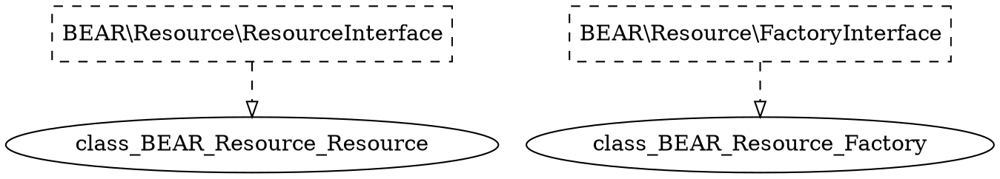

## Ray.Diアプリケーションのグラフ化

Ray.Diは洗練されたアプリケーションのオブジェクトグラフを詳細に表すことができます。オブジェクトビジュアルグラファーは、このデータを理解しやすいビジュアライゼーションとして公開します。複雑なアプリケーションの複数のクラスの束縛や依存関係を、統一されたダイアグラムで表示することができます。

### .dotファイルの生成
Ray.Diのオブジェクトビジュアルグラファーは、オープンソースのグラフ可視化パッケージである[GraphViz](http://www.graphviz.org/)を大きく活用しています。グラフの仕様と視覚化・レイアウトをきれいに分離することができます。`Injector`用のグラフ`.dot`ファイルを作成するには、以下のコードを使用します。

```php
use Ray\ObjectGrapher\ObjectGrapher;

$dot = (new ObjectGrapher)(new FooModule);
file_put_contents('path/to/graph.dot', $dot);
```

### .dotファイル
上記のコードを実行すると、グラフを指定した`.dot`ファイルが生成されます。ファイルの各エントリは、グラフのノードまたはエッジを表します。以下は`.dot`ファイルのサンプルです。



### .dotファイルのレンダリング
そのコードを[GraphvizOnline](https://dreampuf.github.io/GraphvizOnline/)に貼り付けて、レンダリングすることができます。

Linuxでは、コマンドラインの`dot`ツールを使って、`.dot`ファイルを画像に変換することができます。

```shell
dot -T png graph.dot > graph.png
```


#### グラフ表示

エッジ
   * **実線** は、実装から依存する型への依存を表します。
   * **破線** は、型からその実装への束縛を表します。
   * **二重矢印** は、束縛または依存関係が `Provider` にあることを表します。

ノード
   * 実装の型は *黒色の背景* で表示されます。
   * 実装のインスタンスには *灰色の背景* を与えられています。
